class: middle, center, title-slide
name: lecture1

# Web Dynamique côté Serveur
## Lecture 1 : Introduction
<br><br>
Simon BERNARD<br>
[simon.bernard@univ-rouen.fr](mailto:simon.bernard@univ-rouen.fr)<br><br>
.center.height-4em[]

---
class: middle, center
# Le Web

---
# Internet et Web

.center.width-75[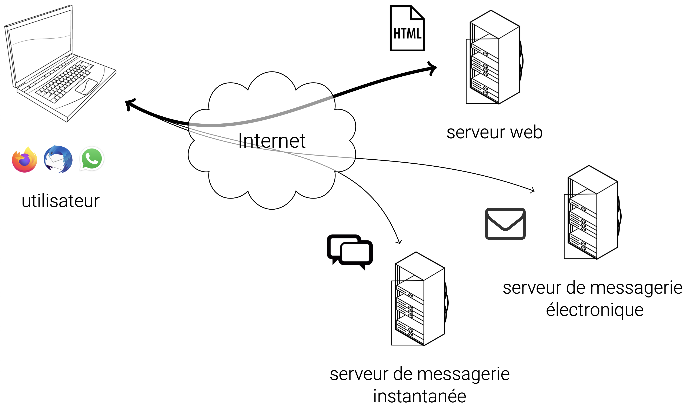]

.center[Internet est un réseau de réseaux. Le Web est une partie de l'information circulant sur Internet.]

---
# Environnement client-serveur

- **Client** : ordinateur/logiciel qui demande une ressource. Le plus souvent, un navigateur web qui demande une ressource web ou qui sollicite un service web.
- **Serveur** : ordinateur/logiciel qui répond à cette demande et qui fournit la ressource ou le service.

.center.width-70[]

---
# Uniform Resource Locator (URL)

- Pour demander une ressource à un serveur, le client doit pouvoir l'identifier
- Il utilise pour cela une URL de la forme :
```shell
protocole://adresse/chemin/ressource
```

où
- `protocole` est un protocole de communication entre deux ordinateurs
- `adresse` est l'adresse réseau du serveur (adresse IP ou nom de domaine)
- `chemin` est le nom de l'application et/ou le chemin où trouver la ressource sur le serveur
- `ressource` est le nom de la ressource demandée

---
count: false
# Uniform Resource Locator (URL)

- Pour demander une ressource à un serveur, le client doit pouvoir l'identifier
- Il utilise pour cela une URL de la forme :
```shell
protocole://adresse/chemin/ressource
```

Exemples :
- `http://www.univ-rouen.fr/`
- `http://192.168.0.3/index.html`
- `http://localhost:8080/MonApp/login`
- `https://mastersd.univ-rouen.fr/sime.php`
- `https://universitice.univ-rouen.fr/course/view.php?id=23754`
- `https://www.mameteo.fr/MonServiceWeb/meteo`

---
# Hypertext Transfer Protocol (HTTP)

- Pour communiquer, le client et le serveur s'échangent des messages
- Ces messages respectent une syntaxe prédéfinie
- Pour le Web, cette syntaxe est définie par le protocole HTTP (ou HTTPS en version chiffrée)

Exemple de requête HTTP envoyé par le client vers le serveur :
```shell
GET /sime.html HTTP/1.1
Host: mastersd.univ-rouen.fr
...
User-Agent: Mozilla/5.0 (X11; Linux x86_64)
Accept: text/html,application/xhtml+xml,...
Referer: http://mastersd.univ-rouen.fr
...
```

---
count: false
# Hypertext Transfer Protocol (HTTP)

- Pour communiquer, le client et le serveur s'échangent des messages
- Ces messages respectent une syntaxe prédéfinie
- Pour le Web, cette syntaxe est définie par le protocole HTTP (ou HTTPS en version chiffrée)

Exemple de réponse HTTP envoyée par le serveur au client :
```shell
HTTP/1.1 200 OK
Date: Mon, 27 Jul 2009 12:28:53 GMT
Server: Apache/2.2.14 (Win32)
Content-Type: text/html; charset=UTF-8

<!DOCTYPE html>
<html>
<head>
...
```

---
# Méthode HTTP

- Le protocole HTTP définit plusieurs méthodes pour indiquer l'action que le client souhaite effectuer sur la ressource demandée.
- Il en existe exactement 9 :
  - `GET` : récupérer une ressource
  - `POST` : envoyer des données au serveur pour traitement
  - `PUT` : mettre à jour une ressource existante (la remplacer)
  - `DELETE` : supprimer une ressource
  - `PATCH` : appliquer des modifications partielles à une ressource
  - `HEAD` : récupérer uniquement les en-têtes d'une ressource
  - `OPTIONS` : récupérer les méthodes supportées par le serveur pour une ressource
  - `TRACE` : récupérer le message de requête tel qu'il a été reçu par le serveur
  - `CONNECT` : établir un tunnel vers le serveur (quand celui-ci est derrière un proxy)


---
# Méthode HTTP

- Statut de la réponse HTTP : code numérique + message associé
- Les codes sont regroupés en 5 classes :
  - `1xx` : information
  - `2xx` : succès
  - `3xx` : redirection
  - `4xx` : erreur côté client
  - `5xx` : erreur côté serveur

Exemples:
- `200 OK` : la requête a réussi et la ressource est renvoyée
- `404 Not Found` : la ressource demandée n'existe pas sur le serveur
- `500 Internal Server Error` : le serveur a rencontré une erreur inattendue
- `503 Service Unavailable` : le serveur est temporairement indisponible (surcharge, maintenance, etc.)
- `301 Moved Permanently` : la ressource a été déplacée de façon permanente à une autre URL


---
# Exemple avec un navigateur web

Le client est un navigateur web et la ressource demandée est une page web:

1. Le client (navigateur) envoie une requête HTTP `GET` pour récupérer la page web demandée
2. Le serveur web reçoit la requête, traite la demande et renvoie une réponse HTTP qui contient le code `200 OK` en en-tête et le contenu de la page web en corps de réponse
3. Le client (navigateur) reçoit la réponse, interprète le code HTML et affiche la page web à l'utilisateur

.center.width-80[]

---
class: middle, center
# Le Web dynamique

---
# Ressource Web

- Une ressource web est la ressource cible d’une requête d’un client vers un serveur
- Au sens stricte, il s’agit de tout ce qui peut être identifié sur le Web (nommé et adressé)
- Par exemple :
  - une page web (HTML/CSS/JS)
  - une image ou une vidéo
  - un service (par exemple ”la météo du jour à Rouen”)
  - des données (XML, JSON)
  - un fichier à télécharger
  - etc.

---
# Site Web statique vs dynamique

.box[**Site web statique** : site web dont les pages sont pré-générées et stockées sur le serveur, et qui sont identiques à chaque consultation.]

.box[**Site web dynamique** : site web dont les pages sont générées à la demande, en fonction de la requête ou d'informations contextuelles, contrairement à un site web statique dont le contenu est identique à chaque consultation.]

.center.width-75[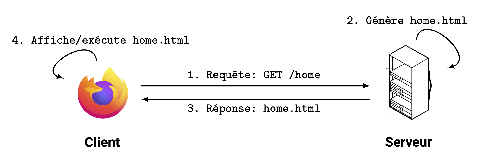]

---
# Web dynamique 

Plusieurs façons de générer des pages web dynamiques:

1. **Programme serveur** : programme externe dans un langage dédié (Jakarta EE, .NET) qui génère des pages HTML, les transmet au serveur web qui les envoie ensuite au client
2. **Server-side scripting** : pages HTML incorporant du code dans un langage de script serveur (ASP, PHP, JSP, etc.), interprétées par le serveur avant d’être transmises au client
3. **Client-side scripting** : pages HTML incorporant du code dans un langage de script client (JavaScript), directement transmises au client et interprétées par le navigateur web
4. **Applications Internet Riches** : programme dans un langage générique (web ou non), qui s'exécute côté client et pouvant envoyer des requêtes web (JS+AJAX, JavaFX, Android, etc.)

Dans ce cours, nous nous concentrerons sur les approches 1 et 2, avec des programmes serveur en Java (Jakarta EE)

---
# Serveur web

.box[**Serveur web (ou serveur HTTP)** : logiciel de service de ressources web, qui répond à des requêtes HTTP provenant de réseau public (Internet) ou privé (intranet).]

- Capable de recevoir et de prendre en charge des requêtes HTTP
- Propose également des fonctionnalités de bases, e.g. gestion des accès, des sessions, des erreurs, etc.

.center.width-35[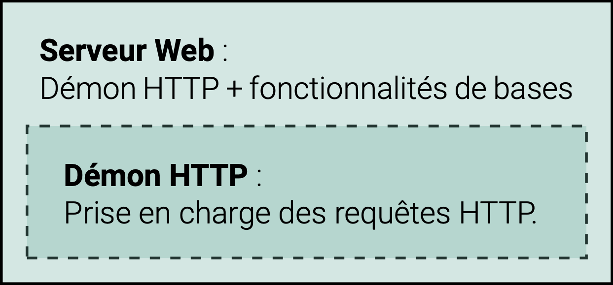]

---
# Serveur web

## Exemples de serveurs web

- Apache HTTP Server (httpd) : [https://httpd.apache.org/](https://httpd.apache.org/)
- Nginx : [https://nginx.org/](https://nginx.org/)
- Lighttpd : [https://lighttpd.net/](https://lighttpd.net/)
- OpenLiteSpeed : [https://openlitespeed.org/](https://openlitespeed.org/)
- H2O : [https://h2o.examp1e.net/](https://h2o.examp1e.net/)
- Caddy : [https://caddyserver.com/](https://caddyserver.com/)
- Microsoft Internet Information Services (IIS) : [https://www.iis.net/](https://www.iis.net/)

---
# Serveur d'application

- Un serveur HTTP ne peut servir que des ressources statiques (HTML, CSS, JS, images, etc.).
- Pour générer dynamiquement des ressources, il faut pouvoir exécuter des programmes dédiés.
- Ces programmes sont conçus avec des technologies spécifiques : Jakarta EE, .NET, Ruby on Rails, etc.
- Un **serveur d'application** est un serveur qui intègre des outils de prise en charge de ces technologies.
- Le plus souvent des **conteneurs** qui fournissent l'environnement d'exécution pour ces technologies.

.center.width-40[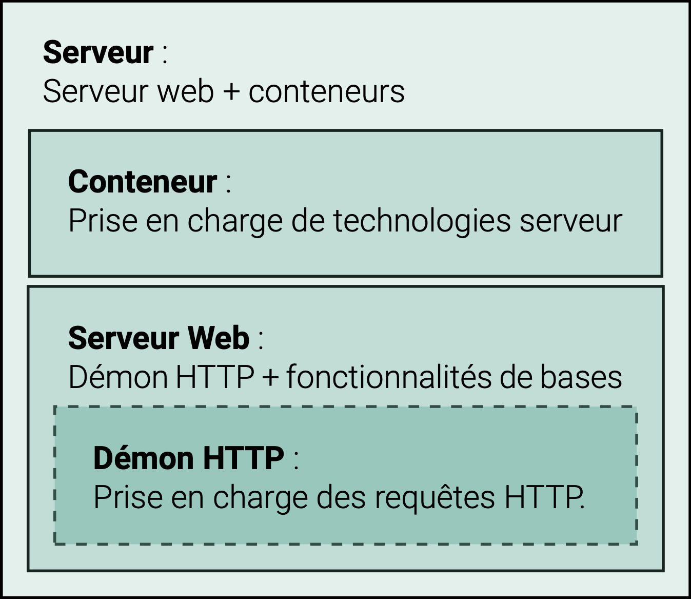]

---
# Serveur d'application
## Exemples de serveurs d'application pour Jakarta EE

- GlassFish : [https://glassfish.org/](https://glassfish.org/)
- WildFly (anciennement JBoss) : [https://www.wildfly.org/](https://www.wildfly.org/)
- Payara Server : [https://www.payara.fish/](https://www.payara.fish/)
- Apache Geronimo : [https://geronimo.apache.org/](https://geronimo.apache.org/)
- Apache TomEE : [https://tomee.apache.org/](https://tomee.apache.org/)
- IBM WebSphere Application Server : [https://www.ibm.com/products/liberty](https://www.ibm.com/products/liberty)
- Oracle WebLogic Application Server : [https://www.oracle.com/fr/java/weblogic/](https://www.oracle.com/fr/java/weblogic/)
- Apache Tomcat : [https://tomcat.apache.org/](https://tomcat.apache.org/)
- Eclipse Jetty : [https://jetty.org/](https://jetty.org/)

.small[Liste des serveurs qui prennent en charge l'ensemble des API Jakarta EE : [https://jakarta.ee/compatibility/](https://jakarta.ee/compatibility/) (note : Tomcat et Jetty ne prennent en charge qu'une partie des spécifications JEE)]

---
class: middle, center
# Jakarta EE

---
# Plateforme Java

- Comprend des outils de développement et d'exécution des applications Java
  - **Environnement d'exécution (JRE)**, avec notamment la machine virtuelle Java (JVM)
  - **Environnement de développement (JDK)**, avec le JRE et des outils de développement (compilateur, débogueur, etc.)
- Comprend des bibliothèques et frameworks pour faciliter le développement
  - bibliothèques standards
  - outils additionnels : gestion de production, IDE, serveurs, etc.

.width-10[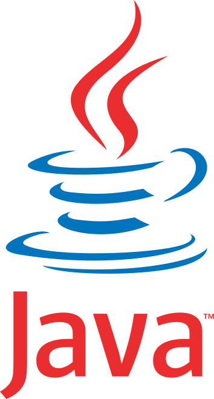]


---
# Éditions de la plateforme Java

- **Édition standard (Java SE)** : applications *standalone* (pour ordinateur de bureau)
- **Édition entreprise (Jakarta EE)** : applications d'entreprise, avec architectures distribuées et fonctionnalités avancées de sécurité, performances, et évolutivité.
- Jakarta EE étend Java SE avec des outils pour :
  - les architectures client-serveur
  - les architectures distribuées, transactionnelles et portables
  - les applications "critiques" (haute disponibilité, performance, sécurité)

.small[Note : il existe 2 autres éditions : **Java ME** (Micro Edition), pour les appareils mobiles et embarqués ; et **Java Card**, pour les cartes à puce et les dispositifs à ressources limitées.]

.width-10[]

---
# Versions de Jakarta EE

.center.width-100[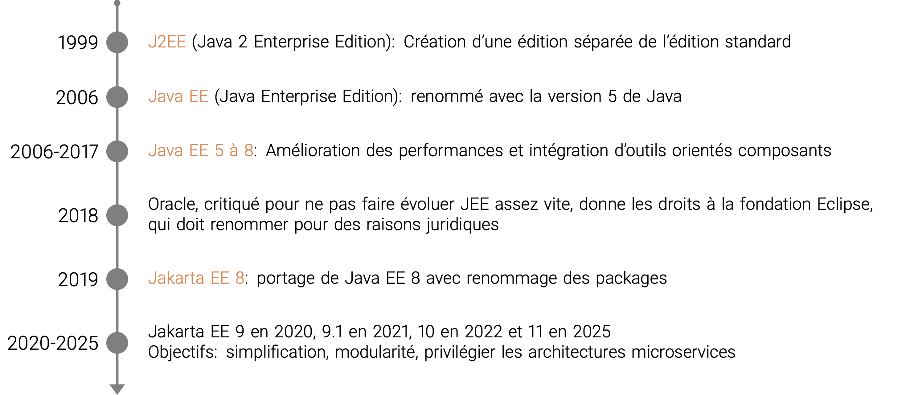]

---
# API Jakarta EE 10

.center.width-100[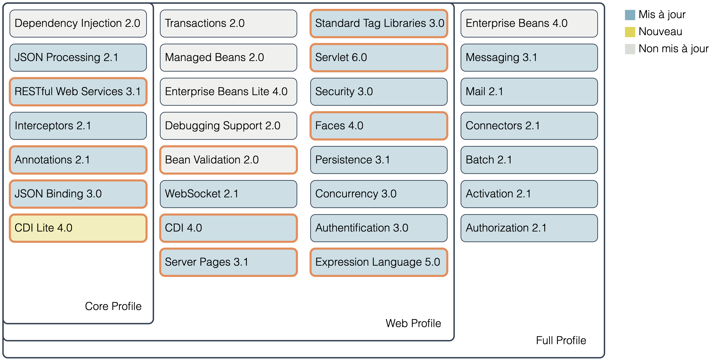]

---
# Profils, services et composants

- Ces API sont des spécifications des services fournis par Jakarta EE.
- Il en existe 3 types, regroupés par profil :
  - **Profil Core** : services fondamentaux
  - **Profil Web** : Profil Core + services spécifiques au Web
  - **Profil Full** : Profil Web + services additionnels (e.g. mails)
- Les services sont mis en oeuvre par des **composants Jakarta EE**.
- Un composant Jakarta EE est une unité fonctionnelle autonome, déployé dans un conteneur
- 2 types de composants :
  - **Composants web** pour les intéractions web : Servlets, Faces, WebSocket
  - **Composants métier** pour la logique métier : EJB, CDI

---
#  Exemples d'API Jakarta EE

| Service | Spécification | Profil |
|---------|---------------|--------|
| Gestion des requêtes HTTP | Jakarta Servlet | Web |
| Interfaces utilisateur | Jakarta Faces | Web |
| Injection de dépendance | Jakarta CDI (Lite) | Core |
| Services Web REST | Jakarta RESTfull Web Services | Core |
| Traitement du format JSON | Jakarta JSON Processing et Jakarta JSON Binding | Core |
| Gestion d'email | Jakarta Mail | Full |

---
# Structure et packaging d'une application Jakarta EE

- Une application JEE est composée d'un ou plusieurs modules, chacun regroupant ses propres composants et ressources :
  - **Module Web** : composants web (Servlets, Faces, etc.) et ressources web (HTML, CSS, images, etc.)
  - **Module de beans entreprises** : composants métier de type EJB
  - **Module de ressources** : ressources partagées (fichiers de configuration, bibliothèques, etc.)
- Un module est empaqueté dans un fichier d'archive :
  - **WAR** (Web Application Archive) : pour les modules Web
  - **JAR** (Java Archive) : pour les modules de beans entreprises et de ressources
  - **EAR** (Enterprise Application Archive) : pour les applications JEE, qui regroupe plusieurs modules
- Un fois empaqueté, le module peut être déployé sur un serveur d'applications compatible

---
# Exemple des modules Web

Une archive `WAR` doit contenir :

- Des ressources web (HTML, CSS, JS, images, etc.) accessibles publiquement
- Un dossier `WEB-INF` contenant les fichiers privés
- Un sous-dossier `classes` avec les classes Java compilées (`.class`)
- Un sous-dossier `lib` avec les bibliothèques Java nécessaires (`.jar`)
- Un descripteur de déploiement au format `XML` (`web.xml` pour les modules Web)

.center.width-55[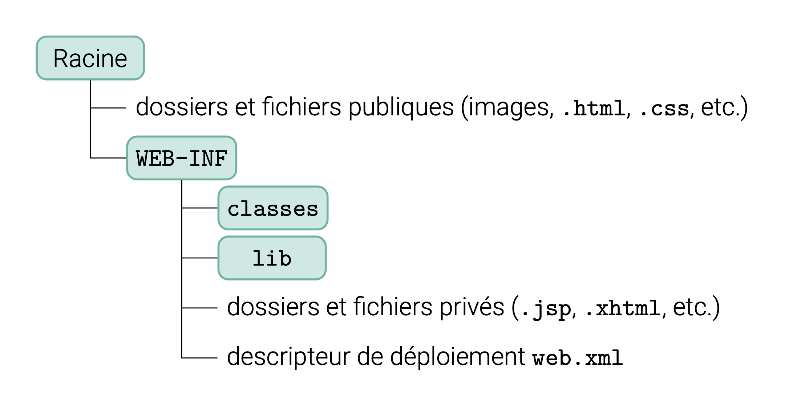]

---
class: middle, dark-slide

# Configuration d'un serveur d'application Jakarta EE avec VScode

---
class: middle, center
# Architecture des applications web

---
# Architecture 2-tiers (client-serveur)

- Architecture basique, pour des site web statiques ou des applications simples
- **Tier Client** : application avec interface utilisateur (HTML, CSS, JS)
- **Tier Serveur** : application avec accès aux données (ressources propres)

.center.width-65[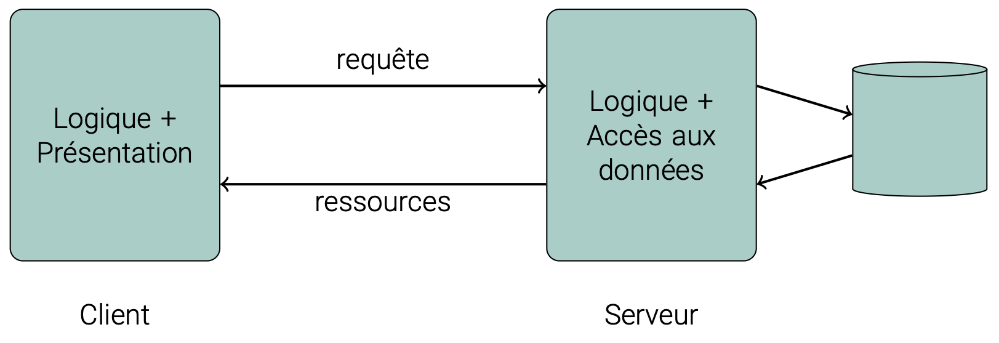]

---
# Architecture 3-tiers

- Architecture classique pour les applications web
- **Tier Présentation** : interface utilisateur (HTML, CSS, JS)
- **Tier Application** : logique métier (traitement des données, logique métier)
- **Tier Données** : accès aux données (base de données, fichiers, etc.)

.center.width-80[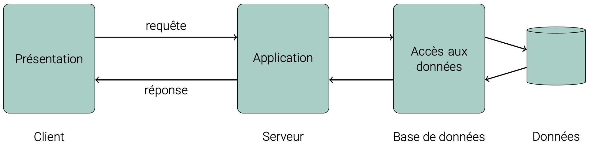]

---
# Architecture N-tiers

- Architecture plus complexe, avec plusieurs couches supplémentaires de traitement
- Les couches peuvent être réparties sur plusieurs serveurs distincts
- Permet de répartir la charge, d'améliorer la performance et la scalabilité
- Exemple :

.center.width-85[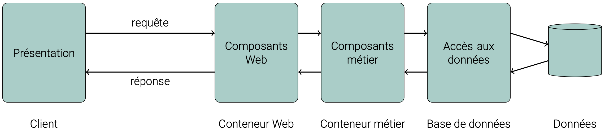]

---
# Modèle-Vue-Contrôleur pour le Web

- Architecture basée sur le patron de conception MVC
- **Modèle** : gestion des données et de la logique métier
- **Vue** : présentation des données (interface utilisateur)
- **Contrôleur** : gestion des interactions utilisateur et coordination entre le modèle et la vue

.center.width-60[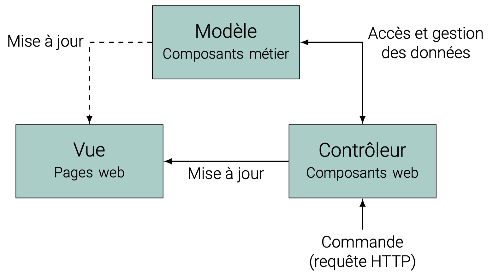]

---
# Modèle-Vue-Contrôleur pour le Web

- Le modèle est souvent mis en œuvre par des composants métier (EJB, CDI)
- La vue et le contrôleur sont souvent mis en œuvre par des composants web (Servlets, Faces)
- Exemple :

.center.width-85[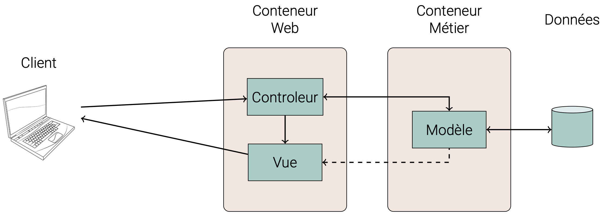]

---
# Architecture Orientée Service (SOA)

- Architecture basée sur des services indépendants
- Chaque service est autonome et expose une interface pour interagir avec d'autres services
- Permet de créer des applications modulaires, évolutives et maintenables

.center.width-55[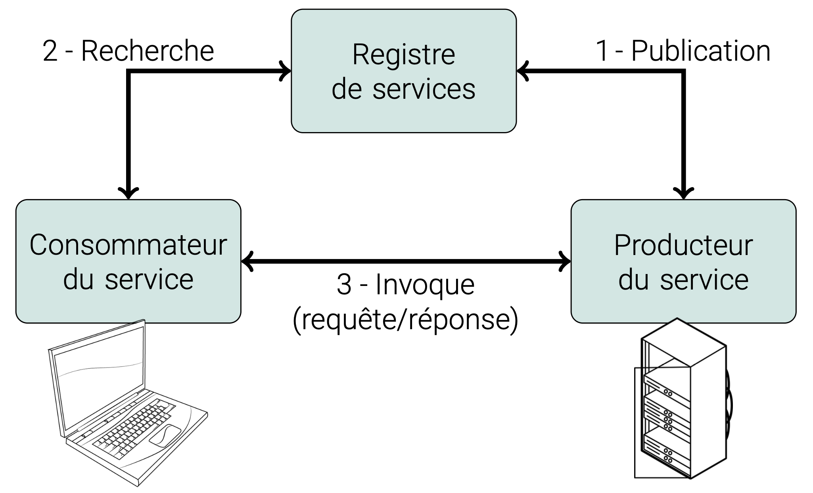]

---
# Architecture microservices

- Similaire à SOA mais avec des services plus petits et plus légers
- Chaque microservice prend en charge **une** fonctionnalité spécifique
- Communication entre microservices via des API légères et uniformes (REST)

.center.width-70[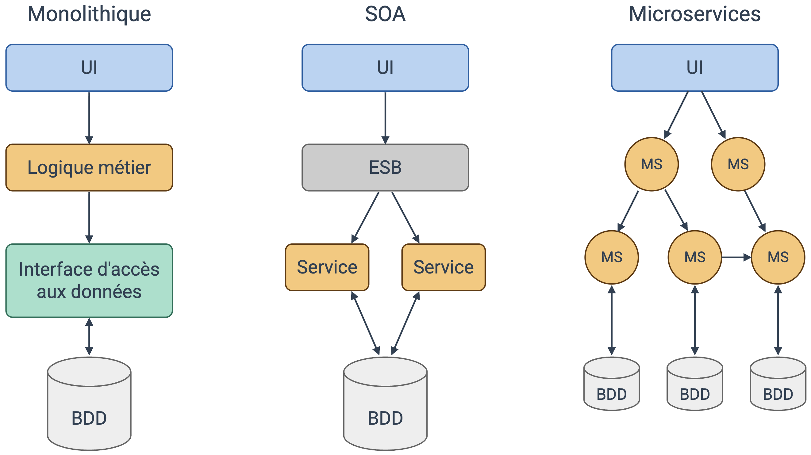]

.footnote[Note: ESB, Enterprise Service Bus, est un composant qui permet de gérer la communication entre les services dans une architecture SOA. Il agit comme un intermédiaire pour faciliter l'intégration et la coordination des services.]

---
# En résumé...

- **Web** = client-serveur + URL + HTTP
- **Web dynamique côté serveur**: concevoir un programme côté serveur pour générer dynamiquement des ressources web
- Configuration serveur: **serveur web + serveur d'application + outils de développement** (automatisation de configuration, déploiement, tests, etc.)
- **Jakarta EE** = plateforme Java pour le développement d'applications web et d'entreprise, avec des API pour les services web, la gestion des données, la sécurité, etc.
- Architectures web = N-tiers, **MVC**, SOA ou **microservices** (de la plus ancienne à la plus moderne)
