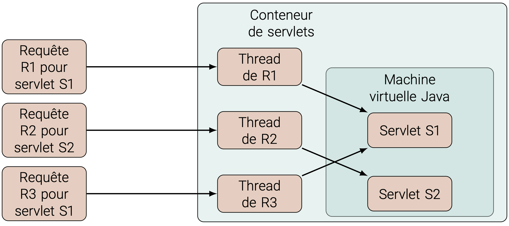
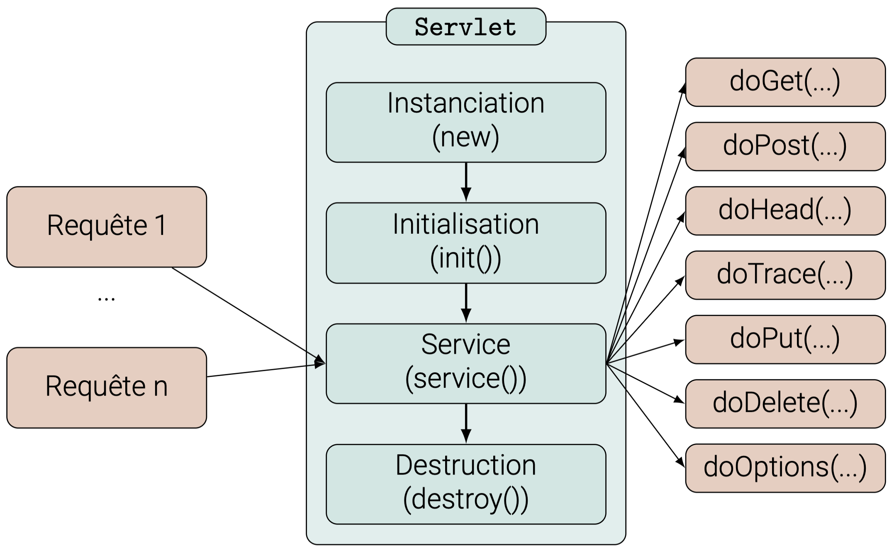

class: middle, center, title-slide
name: lecture2

# Web Dynamique côté Serveur
## Lecture 2 : Jakarta Servlet
<br><br>
Simon BERNARD<br>
[simon.bernard@univ-rouen.fr](mailto:simon.bernard@univ-rouen.fr)<br><br>
.center.height-4em[]

---
class: middle, center
# Le composant servlet

---
# Le composant servlet

.box[Une **servlet** est un objet Java capable de recevoir des requêtes et de générer des réponses à ces requêtes. Il s'agit le plus souvent de requêtes et réponses HTTP, mais il est techniquement possible de prendre en charge d'autres protocoles.]

- **Composants web de base, pour convertir les requêtes HTTP en objets Java**
- Définir une classe Java qui implémente (directement ou indirectement) l'interface `Servlet`
- Pour HTTP, on peut utiliser la classe abstraite `HttpServlet` qui implémente déjà cette interface
- Redéfinir au moins une méthode de traitement des requêtes HTTP (`doGet()`, `doPost()`, etc.)
- À la reception d'une requête, le conteneur web instancie cette classe et appelle l'une de ces méthodes

---
# Le composant servlet

## Exemple

```java
import jakarta.servlet.*;
import java.io.IOException;

public class HelloServlet extends HttpServlet {

    @Override
    public void doGet(HttpServletRequest req,HttpServletResponse res)
    throws ServletException, IOException {
        res.setContentType("text/html");
        PrintWriter out = res.getWriter();
        out.println("<html>");
        out.println("<head><title> Titre </title></head>");
        out.println("<body>");
        out.println("Hello World");
        out.println("</body>");
        out.println("</html>");
        out.close();
    }
}
```

---
# Le composant servlet

## Exemple

La page HTML générée par la servlet est la suivante :

```html
<html>
<head><title> Titre </title></head>
<body>
Hello World
</body>
</html>
```

Le navigateur affiche :

.center.width-55.framed[]

---
# Déploiement

- Après déploiement de l'application, chaque classe Servlet est instanciée une fois
- L'instance est chargée dans le conteneur de servlet et prête à recevoir des requêtes
- Toutes les requêtes destinées à une même servlet sont traitées par la même instance

.center.width-75[]

---
# Cycle de vie

- Le conteneur de servlets est responsable de la gestion du cycle de vie des servlets
- Lorsqu'une servlet est demandée pour la première fois, le conteneur crée l'instance et appelle `init()`
- La méthode `service()` est invoquée pour chaque requête reçue par la servlet

.center.width-65[]

---
# Configuration et initialisation

- Une classe Servlet doit être annotée avec `@WebServlet`
- Cela permet de configurer la servlet et de la déclarer auprès du conteneur
```java
@WebServlet(
    name = "HelloServlet",
    description = "This is a simple web application",
    urlPatterns = {"/hello", "/hello*"},
    initParams = {
        @WebInitParam(name = "defaultLastname", value = "Doe"),
        @WebInitParam(name = "defaultFirstname", value = "John")
    }
)
public class HelloServlet extends HttpServlet {
    ...
}
```
ou
```java
@WebServlet("/hello")
public class HelloServlet extends HttpServlet {
    ...
}
```

---
# Configuration et initialisation

- Alternative : déclaration dans `web.xml` :
```xml
<web-app xmlns="https://jakarta.ee/xml/ns/jakartaee" xmlns:xsi="http://www.w3.org/2001/XMLSchema-instance"
         xsi:schemaLocation="https://jakarta.ee/xml/ns/jakartaee https://jakarta.ee/xml/ns/jakartaee/web-app_6_0.xsd"
         version="6.0">
    <servlet>
        <servlet-name>HelloServlet</servlet-name>
        <servlet-class>com.example.HelloServlet</servlet-class>
        <init-param>
            <param-name>defaultLastname</param-name>
            <param-value>Doe</param-value>
        </init-param>
        <init-param>
            <param-name>defaultFirstname</param-name>
            <param-value>John</param-value>
        </init-param>
    </servlet>
    <servlet-mapping>
        <servlet-name>HelloServlet</servlet-name>
        <url-pattern>/hello</url-pattern>
    </servlet-mapping>
</web-app>
```
- Remplace l'annotation `@WebServlet` (il ne faut pas utiliser les deux)
- Si vous définissez vous-même la servlet, privilégiez l'annotation

---
# Configuration et initialisation

- `init()` est appelée par le conteneur à l'initialisation de la servlet. Elle peut être redéfinie **si nécessaire**
- Elle permet de configurer la servlet avant que celle-ci ne traite des requêtes
- Exemple : récupération des paramètres d'initialisation
```java
public class HelloServlet extends HttpServlet {
    @Override
    public void init(ServletConfig config) throws ServletException {
        super.init(config); // <-- obligatoire
        String defaultLastname = config.getInitParameter("defaultLastname");
        String defaultFirstname = config.getInitParameter("defaultFirstname");
        ... // autres initialisations, e.g. connexion BDD, initialisation de ressources, etc.
    }
}
```
- `config` est un objet créé par le conteneur pour transmettre les informations de configuration à la servlet
- De la même manière, la méthode `destroy()` est appelée par le conteneur lors de la destruction


---
class: middle, center
# Traitement des requêtes

---
# Traitement des requêtes

- Une méthode pour chaque type de requête HTTP :
```java
protected void doGet(HttpServletRequest req, HttpServletResponse res) throws ServletException, IOException;
protected void doPost(HttpServletRequest req, HttpServletResponse res) throws ServletException, IOException;
protected void doPut(HttpServletRequest req, HttpServletResponse res) throws ServletException, IOException;
protected void doDelete(HttpServletRequest req, HttpServletResponse res) throws ServletException, IOException;
protected void doHead(HttpServletRequest req, HttpServletResponse res) throws ServletException, IOException;
protected void doOptions(HttpServletRequest req, HttpServletResponse res) throws ServletException, IOException;
protected void doTrace(HttpServletRequest req, HttpServletResponse res) throws ServletException, IOException
```
- 2 paramètres de type `HttpServletRequest` et `HttpServletResponse`
- Ces objets sont créés par le conteneur et encapsulent les informations de la requête et de la réponse
- `HttpServletRequest` donne accès aux informations sur le client et l'environnement serveur
- `HttpServletResponse` permet de construire la réponse à envoyer au client

---
# Traitement des requêtes

## Exemple

```java
protected void doGet(HttpServletRequest req, HttpServletResponse res)
throws ServletException, IOException {
    res.setContentType("text/plain");
    PrintWriter out= res.getWriter();
    out.println("Protocol: " + req.getProtocol());
    out.println("Scheme: " + req.getScheme());
    out.println("ServerName: " + req.getServerName());
    out.println("ServerPort: " + req.getServerPort());
    out.println("RemoteAddr: " + req.getRemoteAddr());
    out.println("RemoteHost: " + req.getRemoteHost());
    out.println("Method: " + req.getMethod());
    out.close();
}
```

---
# Paramètres de requête

- Une requête HTTP peut inclure des paramètres
- Par exemple, via un formulaire :

.row[
.col-65[
```html
<form action="/Demo/FormServlet" method="get">
    <label>Nom : </label>
    <input name="name" type="text">
    ...
    <input type="submit" value="Envoyer">
</form>
```
]
.col-35[
.width-90[]
]
]

- `action` : URL de la servlet qui traitera la requête
- `method` : méthode HTTP utilisée pour envoyer les données (`GET` ou `POST`)
- Bouton "Envoyer" : les données saisies sont encapsulées dans la requête et envoyées à l'URL spécifiée

---
# Paramètres de requête

- Chaque information saisie est un paramètre de la forme `clé=valeur`, où la clé est le `name` de `input`
- Si méthode `GET`, les paramètres sont transmis dans l'URL :
```shell
http://localhost:8080/Demo/FormServlet?name=Doe&firstname=John&age=30
```
- Si méthode `POST`, les paramètres sont transmis dans le corps de la requête
- Dans les deux cas, la servlet peut récupérer les paramètres via l'objet `HttpServletRequest` :
```java
    String name = req.getParameter("name");
    String firstname = req.getParameter("firstname");
    String age = req.getParameter("age");
```
ou
```java
    Enumeration<String> names = req.getParameterNames();
    while (names.hasMoreElements()) {
        String paramName = names.nextElement();
        String paramValue = req.getParameter(paramName);
    }
```

---
# Communication entre servlets

- Au sein d'une même application, plusieurs servlets peuvent partager des informations
- Instance de type `ServletContext`, créée par le conteneur au démarrage de l'application
- Chaque servlet peut accéder à cet objet via la méthode `getServletContext()`.
- On peut y stocker des attributs partagés entre les servlets :
```java
    getServletContext().setAttribute("sharedString", "Hello World");
    String sharedString = (String) getServletContext().getAttribute("sharedString");
    MyData data = new MyData();
    getServletContext().setAttribute("sharedData", data);
    MyData sharedData = (MyData) getServletContext().getAttribute("sharedData");
```
- Ces attributs sont accessibles par toutes les servlets de l'application

---
# Communication entre servlets

- Possibilité aussi de définir des paramètres de contexte via `ServletContext`
- Dans `web.xml` :
```xml
    <context-param>
        <param-name>emailAdmin</param-name>
        <param-value>admin@domain.com</param-value>
    </context-param>
```
- Accès dans une servlet :
```java
    String emailAdmin = getServletContext().getInitParameter("emailAdmin");
```
- Ces paramètres sont globaux pour l'application et accessibles par toutes les servlets

---
# Partage de contrôle

- Une servlet peut appeler une autre servlet pour lui déléguer tout ou partie du traitement d'une requête
- Utilisation de la méthode `forward` de `RequestDispatcher` :
```java
    RequestDispatcher dispatcher = request.getRequestDispatcher("/otherservlet");
    dispatcher.forward(request, response);
```
- Le paramètre de `getRequestDispatcher()` est l'URL de la servlet cible (cf. annotation `@WebServlet`)
- Permet de structurer l'application en plusieurs servlets pour des tâches spécifiques
- Différent d'une redirection :
```java
    response.sendRedirect("http://www.example.com");
    response.sendRedirect("/otherservlet");
```
- Redirige le client vers une nouvelle URL, **changeant l'URL dans le navigateur**

---
# Partage de contrôle

- Possibilité de transmettre des informations au moment du transfert :
```java
    RequestDispatcher dispatcher = request.getRequestDispatcher("/otherservlet?key=value");
```
ou
```java
    request.setAttribute("key", "value");
    RequestDispatcher dispatcher = request.getRequestDispatcher("/otherservlet");
    dispatcher.forward(request, response);
```
- Puis dans la servlet cible :
```java
    String value = (String) request.getAttribute("key");
```
- Ces informations sont valables uniquement pour la requête en cours
- Quand la réponse est envoyée, les objets `request` et `response` sont détruits

---
# Partage de contrôle

- `RequestDispatcher` permet également d'inclure le contenu d'une servlet dans une autre servlet :
```java
    RequestDispatcher dispatcher = request.getRequestDispatcher("/otherservlet");
    dispatcher.include(request, response);
```
- Dans ce cas, la réponse de la servlet incluse est intégrée dans la réponse de la servlet appelante
- `include()` permet de conserver le contrôle dans la servlet appelante
- Différent de `forward()` avec lequel la servlet appelante donne le contrôle, et ne le reprend pas
- Cette méthode est surtout utile pour inclure des contenus statiques :
```java
    RequestDispatcher dispatcher = request.getRequestDispatcher("/header.html");
    dispatcher.include(request, response);
    // Traitement de la servlet principale
    dispatcher = request.getRequestDispatcher("/footer.html");
    dispatcher.include(request, response);
```

---
class: middle, center
# Cookies et sessions

---
# Les cookies

.box[Un **cookie** est une information se présentant sous la forme d'une paire clé/valeur (et optionnellement d'attributs de la même forme), envoyée par le serveur au client et stockée par le navigateur. Il est utilisé pour conserver des informations entre les requêtes HTTP d'un même client.]

- Exemples d'utilisation :
  - Authentification persistante
  - Préférences utilisateur
  - Suivi de session
- Mis à jour par le serveur via les réponses HTTP
- Envoyé par le client dans chaque requête HTTP

---
# Les cookies

- L'API Servlet fournit une classe `Cookie` pour gérer les cookies
- Création d'un cookie :
```java
    Cookie cookie = new Cookie("username", "JohnDoe");
    cookie.setMaxAge(60*60*24); // Durée de vie du cookie (1 jour)
    response.addCookie(cookie);
```
- Récupération des cookies :
```java
    Cookie[] cookies = request.getCookies();
    if (cookies != null) {
        for (Cookie c : cookies) {
            if (c.getName().equals("username")) {
                String username = c.getValue();
                // Utiliser le nom d'utilisateur
            }
        }
    }
```

---
# Les sessions

.box[**Session** : une session est un ensemble d'interactions entre un client et un serveur, donnant lieu à plusieurs requêtes consécutives. Elle permet de conserver des informations sur l'utilisateur pendant toute la durée de l'échange.]

- Exemple : panier d'achats dans un site e-commerce
- HTTP ne prend pas en charge les sessions (protocole sans état)
- Il faut un mécanisme de suivi de session côté serveur (*session tracking*)

---
# Les sessions

- Chaque session est identifiée par un identifiant unique (*session ID*)
- Cet identifiant est créé à la réception de la première requête d'un client
- Il est ensuite transmis dans chacune des requêtes suivantes provenant du même client :
  - via l'URL :
```shell
    http://localhost:8080/Demo/HelloServlet;jsessionid=0A8EA5D9E8665C8AC80F141C3818F6BA
```
  - ou via un cookie (défaut) :
```shell
    Set-Cookie: JSESSIONID=0A8EA5D9E8665C8AC80F141C3818F6BA; Path=/Demo; HttpOnly
```
- Si cookies désactivés, la servlet doit utiliser l'URL *rewriting* pour transmettre l'ID :
```java
    String url = response.encodeURL("/hello"); // ajoute le session ID si nécessaire
    response.sendRedirect(url);
```

---
# Les sessions

- Si elles sont activées, le conteneur de servlets gère les sessions automatiquement
- Récupération ou création d'une session :
```java
    HttpSession session = request.getSession(); // récupére la session existante ou en crée une nouvelle
    session.setMaxInactiveInterval(60*30); // Durée de vie de la session (30 minutes)
```
- La session doit être récupérée avant d'écrire dans la réponse
- Partage d'informations via la session :
```java
    session.setAttribute("username", "JohnDoe");
    String username = (String) session.getAttribute("username");
    session.removeAttribute("username"); // Supprimer un attribut de session
    session.invalidate(); // Détruire la session
```

---
class: middle, dark-slide

# Live coding : création d'une servlet simple
