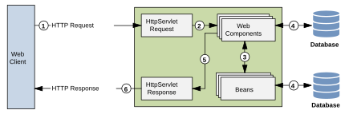
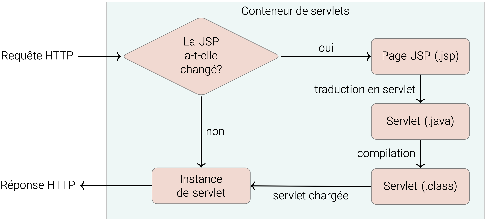
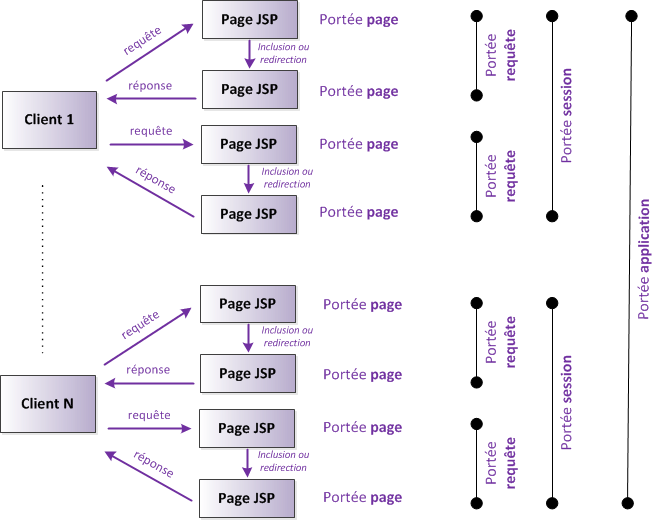
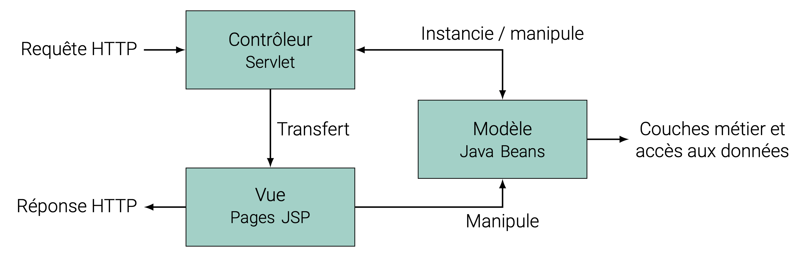

class: middle, center, title-slide
name: lecture2

# Web Dynamique côté Serveur
## Lecture 3 : Jakarta Server Pages
<br><br>
Simon BERNARD<br>
[simon.bernard@univ-rouen.fr](mailto:simon.bernard@univ-rouen.fr)<br><br>
.center.height-4em[]


---
class: middle, center
# Présentation de JSP

---
# Application orientée présentation

- **Orientée présentation (site web)** : génère du contenu HTML/CSS/JS pour des clients légers (navigateur)
- **Orientée services (services web)** : génère des données structurées (JSON, XML) pour des clients lourds (applications, services)

.center.width-75[]

---
# Application orientée présentation

Servlet est suffisant mais peu pratique

```java
import jakarta.servlet.*;
import java.io.IOException;

public class HelloServlet extends HttpServlet {

    @Override
    public void doGet(HttpServletRequest req,HttpServletResponse res)
    throws ServletException, IOException {
        res.setContentType("text/html");
        PrintWriter out = res.getWriter();
        out.print("<html>\n");
        out.print("\t<head>\n");
        out.print("\t\t<title>Bonjour</title>\n");
        out.print("\t</head>\n");
        out.print("\t<body>\n");
        out.print("\t\t<h1>Bonjour</h1>\n");
        out.print("\t\tNous sommes le ");
        out.print( new java.util.Date().toString() );
        out.print("\t</body>\n");
        out.print("</html>");
        out.close();
    }
}
```

---
# Application orientée présentation

- Besoin d'une technologie plus appropriée de type *server-side scripting*
```html
    <html>
        <head> <title>Une premiere JSP</title> </head>
        <body>
            <% //Il est possible d'ecrire du code Java pur
                Date date = new Date();
                nombreVisites++;
            %>
            <!-- ou d'utiliser des balises JSP speciales -->
            <h1>Exemple</h1>
            <p>nous sommes le <%= date %>.</p>
            <p>page affichee <%= nombreVisites %> fois !</p>
        </body>
    </html>*
```
- Page `.jsp` : mélange HTML et balises spéciales permettant l'insertion de code Java
- Côté serveur, la page est convertie en servlet automatiquement
- Plus facile à écrire mais moins performante et peu adaptée pour des applications complexes

---
# Jakarta Server Pages

- Technologie de présentation pour les applications web
- Basée sur Servlet (mêmes capacités)
- Simplifie l'utilisation des servlets, en particulier pour les développeurs *front-end*

.center.width-75[]

---
# Jakarta Server Pages

## Exemple : la page JSP

```html
<%@ page language="java" contentType="text/html; charset=UTF-8" pageEncoding="UTF-8"%>
<!DOCTYPE html>
<html>
    <head>
        <meta http-equiv="Content-Type" content="text/html; charset=UTF-8">
        <title>My first JSP page</title>
    </head>
    <body>
        <p class="info"><%="Hello World!" %></p>
    </body>
</html>
```

---
# Jakarta Server Pages

## Exemple : la servlet correspondante

```java
public final class index_jsp
    extends org.apache.jasper.runtime.HttpJspBase
    implements org.apache.jasper.runtime.JspSourceDependent, org.apache.jasper.runtime.JspSourceImports {
    ...
    public void _jspService(final javax.servlet.http.HttpServletRequest request, final javax.servlet.http.HttpServletResponse response)
    throws java.io.IOException, javax.servlet.ServletException {
        ...
        response.setContentType("text/html; charset=UTF-8");
        ...
        out.write("\n");
        out.write("<!DOCTYPE html>");
        out.write("<html>\n");
        ...
        out.write("\t<body>\n");
        out.write("\t\t<p class=\"info\">");
        out.print("Hello World!" );
        out.write("</p>\n");
        ...
    }
}
```

---
class: middle, center
# Le langage JSP

---
# Les balises JSP

- Il existe 5 types de balises de bases:
    - `<%@ ... %>` : Directive (configuration de la page)
    - `<%-- ... --%>` : Commentaire (non affiché dans la page)
    - `<%! ... %>` : Déclaration (définit des méthodes ou des variables)
    - `<%= ... %>` : Expression (affiche le résultat d'une expression)
    - `<% ... %>` : Scriptlet (exécute du code Java)
- Chacune permet d'ajouter du contenu à la classe Servlet correspondante
- Chacune ajoute ce code à un endroit différent

---
# Les directives

- Configuration de la page
- Permet de spécifier au serveur comment il doit générer la servlet correspondante
```html
    <%@ page language="java" contentType="text/html; charset=UTF-8" pageEncoding="UTF-8" %>
    <%@ include file="header.jsp" %>
    <%@ taglib uri="http://java.sun.com/jsp/jstl/core" prefix="c" %>
    <%@ taglib uri="http://java.sun.com/jsp/jstl/fmt" prefix="fmt" %>
    <%@ page import="java.util.Date" %>
```
- `include` : inclure (copier-coller) une autre page JSP ou HTML
- `taglib` : bibliothèque de balises JSP (JSTL)
- `import` : importation de classes Java (ajouté dans la servlet)

---
# Les déclarations

- Permet de définir des méthodes ou des variables
- Ces déclarations sont ajoutées à la classe Servlet correspondante
```html
    <%!
        private int count = 5;
        private String bonjour() {
            return "Bonjour";
        }
    %>
```
```java
    public class MyJSP_jsp implements ... {
        private int count = 5;
        private String bonjour(){
            return "Bonjour";
        }
        public void _jspService(...)... {
            ...
        }
    }
```

---
# Les scriptlet

- Permet d'insérer du code Java dans la page
- Le code est ajouté à la méthode `_jspService()`
- Peu utilisé, car remplacées par des balises JSTL (présentation séparée de la logique)
```html
    <%
        for(int i=0;i<count;i++){
            out.println(bonjour());
        }
        count++;
    %>
```

---
# Les expressions

- Évaluation d'expressions et renvoie de la valeur sous forme de `String`
- Équivalent à `<% out.println(...); %>`
```html
    <h1><%= bonjour() %> le monde !</h1>
```
- Le code est ajouté à la méthode `_jspService()` de la servlet générée
```java
    public void _jspService(final HttpServletRequest request, final HttpServletResponse response) {
        ...
        out.write("\n");
        out.write("<h1>");
        out.print(bonjour());
        out.write(" le monde !</h1>\n");
        ...
    }
```

---
# Les objets implicites

- Les objets implicites des servlets ont des équivalents en JSP, avec des noms d'instances prédéfinis
- `request` : instance de `HttpServletRequest`
- `response` : instance de `HttpServletResponse`
- `session` : instance de `HttpSession`
- `application` : instance de `ServletContext`
- `out` : instance de `JspWriter` (permet d'écrire dans la réponse HTTP)
- `config` : instance de `ServletConfig`
- `page` : instance de la page JSP elle-même (équivalent à `this`)
- `pageContext` : instance de `PageContext` (permet d'accéder à l'environnement de la page JSP)

---
# Les objets implicites

- Chaque objet définit une portée (scope), c'est-à-dire un contexte dans lequel elle est disponible
- Au-delà de cette portée, l'objet n'est plus accessible (potentiellement détruit)
- `pageContext` permet d'accéder à toutes les variables, quelles que soient leur portée

.center.width-50[]

---
# Les objets implicites

## Exemple

```html
<html>
    <head>
        <title>Formulaire HTML</title>
    </head>
    <body>
        <form action="/form.jsp" method="get" class="form">
            <div class='form-row'>
                <label for='full-name'>Name</label>
                <input id='full-name' name='full-name' type='text'/>
            </div>
            <div class='form-row'>
                <label for='email'>Email</label>
                <input id='email' name='email' type='email' placeholder='joe@example.com'/>
            </div>
            <div class='form-row'>
                <button>Submit</button>
            </div>
        </form>
    </body>
</html>
```

---
# Les objets implicites

## Exemple

```html
<html>
    <head>
        <title>Première JSP</title>
    </head>
    <body>
        <%
            String myname = request.getParameter("full-name");
            String myemail = request.getParameter("email");
            session.setAttribute("name", myname);
            session.setAttribute("email", myemail);
            // ou
            pageContext.setAttribute("name", myname, PageContext.SESSION_SCOPE);
            pageContext.setAttribute("email", myemail, PageContext.SESSION_SCOPE);
        %>
        <a href="second.jsp">second jsp page</a>
    </body>
</html>
```

---
# Les objets implicites

## Exemple

```html
<html>
    <head>
        <title>Seconde JSP</title>
    </head>
    <body>
        <%
            String myname = (String) session.getAttribute("name");
            String myemail = (String) session.getAttribute("email");
            // ou
            String myname = (String) pageContext.getAttribute("name", PageContext.SESSION_SCOPE);
            String myemail = (String) pageContext.getAttribute("email", PageContext.SESSION_SCOPE);
        %>
        <h1>Bonjour <%= myname %> !</h1>
        <p>Votre email est <%= myemail %>.</p>
    </body>
</html>
```

---
class: middle, center
# JSP et les beans

---
# Utilisation des beans

- Un *JavaBean* ou *bean* est une classe Java (Plain Old Java Objet ou POJO) qui :
  - définit un constructeur par défaut (public, sans argument)
  - possède des attributs privés (propriétés)
  - fournit des méthodes d'accès (getters et setters) pour ses propriétés
  - est sérialisable (implémente l'interface `Serializable`)
- JSP propose un moyen de manipuler les beans via des balises JSP spéciales :
  - `<jsp:useBean>` : pour créer ou récupérer un bean
  - `<jsp:setProperty>` : pour définir les propriétés du bean
  - `<jsp:getProperty>` : pour obtenir les propriétés du bean

---
# Exemple : bean `Car`

```java
package com.example;

import java.io.Serializable;

public class Car implements Serializable {
    static final long serialVersionUID = 42L;
    private String model;
    private double speed;

    // constructeur par defaut obligatoire (peut être implicite)
    public Car() {
        model = "Bugatti Veyron";
        speed = 407;
    }

    // getters et setters publics
    public double getSpeed() {
        return this.speed;
    }

    public void setSpeed(double newSpeed) {
        if(newSpeed < 0) {
            sendErrorMessage(...);
            newSpeed = Math.abs(newSpeed);
        }
        this.speed = newSpeed;
    }
    ...
}
```

---
# Bean dans la page JSP

- On suppose qu'une instance de `Car` est disponible dans la session sous l'identifiant `myCar`
- Les *scope* possibles sont `page`, `request`, `session` et `application`
```html
    <jsp:useBean id="myCar" class="com.example.Car" scope="session"/>
```
équivalent à :
```java
    com.example.Car myCar = (com.example.Car) request.getAttribute("myCar");
    if ( myCar == null ) {
        myCar = new com.example.Car();
        request.setAttribute("myCar",myCar);
    }
```
- Si le bean n'existe pas, un bean par defaut est créé à la place
- Possibilité de définir un corps, inclut dans la page si le bean n'existe pas
```html
    <jsp:useBean id="myCar" class="com.example.Car" scope="request" />
        <p> Modele par defaut utilisé </p>
    </jsp:useBean>
```

---
# Bean dans la page JSP

- L'intérêt principal est de pouvoir afficher les propriétés du bean dans la page JSP
- On suppose que le bean `myCar` a été déclaré préalablement dans la page
```html
    <%-- affiche le contenu de la propriété 'speed' du bean 'myCar' : --%>
    <jsp:getProperty name="myCar" property="speed" />
```
équivalent à :
```java
    <%= myCar.getSpeed() %>
```
- Cependant, on est sûr avec `<jsp:getProperty>` que le bean existe

---
# Bean dans la page JSP

- On peut créer et initialiser un bean directement dans la page JSP
```html
    <jsp:setProperty name="myCar" property="speed" value="350" />
    <%-- équivalent à : --%>
    <% myCar.setSpeed(350); %>

    <jsp:setProperty name="myCar" property="speed" param="givenSpeed"/>
    <%-- équivalent à : --%>
    <% myCar.setSpeed(request.getParameter("givenSpeed")); %>

    <jsp:setProperty name="myCar" property="speed" />
    <%-- équivalent à : --%>
    <% myCar.setSpeed(request.getParameter("speed")); %>

    <jsp:setProperty name="myCar" property="*" />
    <%-- équivalent à : --%>
    <% myCar.setModel(request.getParameter("model")); %>
    <% myCar.setSpeed(request.getParameter("speed")); %>
```

---
# Expression Language

.box[**Jakarta Expression Language** (EL) est un langage utilisé dans les pages JSP pour accéder facilement aux données des beans et des objets dans le contexte de la requête, de la session ou de l'application. Il permet d'écrire des expressions simples pour récupérer des valeurs sans avoir à écrire du code Java complexe.]

- Syntaxe : `${ expression }`
- `expression` est une opération, un appel à une méthode ou un accès à une variable ou une propriété de bean
- Peut être utilisé dans les balises JSP, le corps de la page (hors balises) et les attributs HTML, etc.
- **Évaluées à l'exécution de la servlet et non à la compilation**

---
# Expression Language

- Pour manipuler les beans, 2 syntaxes : avec l'opérateur `.` ou avec des crochets `[ ]`
```html
    <p>
        La vitesse maximale d'une ${myCar.model} est de : ${myCar.speed}
        La vitesse maximale d'une ${myCar["model"]} est de : ${myCar["speed"]}
    </p>
```
- `myCar` doit exister dans un *scope* (s'il n'est pas précisé, n'importe lequel)
- La classe `Car` doit avoir des accesseurs (getters) pour ses propriétés (sinon exception)
- Contrairement à `jsp:useBean`, si `myCar` n'existe pas, il n'est pas créé (exception)

---
# Expression Language

- Objets de portée dans les EL : `requestScope`, `sessionScope`, `applicationScope`, `pageScope` et `pageContext`
```html
    <p>
        La vitesse maximale d'une ${sessionScope.myCar.model} est de : ${sessionScope.myCar.speed}
        <%-- ou si on ne connait pas le scope --%>
        La vitesse maximale d'une ${pageContext.myCar.model} est de : ${pageContext.myCar.speed}
    </p>
```
Note : `pageContext` permet d'éviter l'exception si `myCar` n'existe pas
- Accès au paramètres et cookies simplifiés : `param` et `cookie`
```html
    <p>
        Le paramètre "model" est : ${param.model}
        Le cookie "user" est : ${cookie.user}
    </p>
```

---
# JSP dans une application MVC

- Techniquement, JSP peut remplacer entièrement l'utilisation des Servlets
- Mais l'intérêt principal est l'utilisation dans une architecture MVC :
  - Servlet pour le contrôleur (reçoit les requêtes)
  - Beans pour le modèle (encapsulent la logique métier et les données)
  - JSP pour la vue (génère la présentation en utilisant les données du modèle)

.center.width-80[]

---
# JSP dans une application MVC

- **Contrôleur**
  - Gère les paramètres des requêtes
  - Lie modèle et vue
  - Si application complexe, un contrôleur est lié à une action spécifique
  - Souvent, *Front Controller*, et des sous-contrôleurs pour les actions spécifiques (*design pattern Command*)
- **Vue**
  - Encapsulent la création des pages Web (réponses)
  - MVC "push-based" : c'est le contrôleur qui fournit les données à la vue (attributs de la requête)
  - MVC "pull-based" : la vue demande les données au modèle (beans)

---
# JSP dans une application MVC

## Exemple : Servlet contrôleur

```java
import com.example.Car;

@WebServlet("/car")
public class CarController extends HttpServlet {
    @Override
    protected void doGet(HttpServletRequest request, HttpServletResponse response)
    throws ServletException, IOException {
        String mo = request.getParameter("model");
        String sp = request.getParameter("speed");

        if (mo != null && !mo.isEmpty() && sp != null && !sp.isEmpty()) {
            Car car = new Car();
            car.setModel(mo);
            car.setSpeed(Double.parseDouble(sp));
            request.setAttribute("car",car);
        }

        RequestDispatcher dis = request.getRequestDispatcher("car.jsp");
        dis.forward(request,response);
    }
}
```

---
# JSP dans une application MVC

## Exemple : page JSP

```html
<%@ page language="java" contentType="text/html; charset=UTF-8" pageEncoding="UTF-8" %>
<%@ page import="com.example.Car" %>
<html>
    <head>
        <title>Car Details</title>
    </head>
    <body>
        <h1>Car Details</h1>
        <jsp:useBean id="car" class="com.example.Car" scope="request">
            <p> No model specified. Default model used instead </p>
        </jsp:useBean>
        <table>
            <tr><td>Model:</td><td><jsp:getProperty name="car" property="model"/></td></tr>
            <tr><td>Speed:</td><td><jsp:getProperty name="car" property="speed"/></td></tr>
        </table>
        <a href="index.jsp">Back to Home</a>
    </body>
</html>
```

---
class: middle, dark-slide

# Live coding: Création d'une application web avec JSP et Servlets
