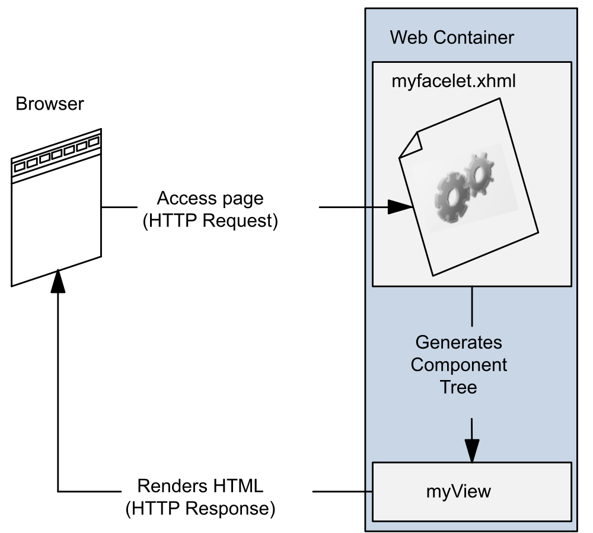
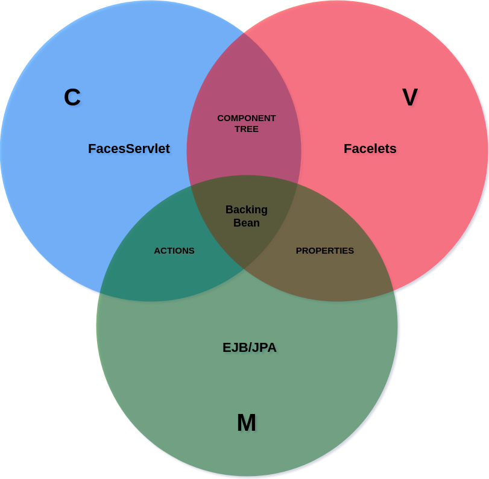
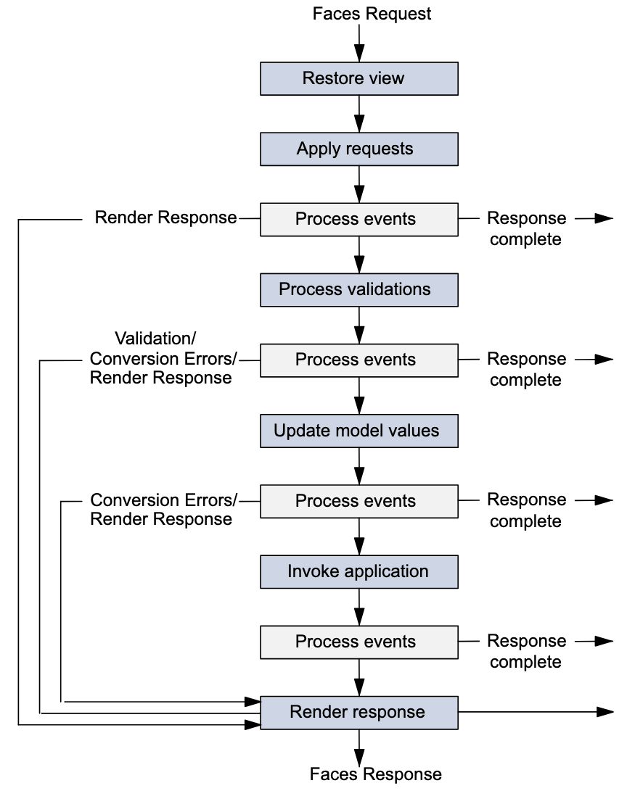

class: middle, center, title-slide
name: lecture4

# Web Dynamique côté Serveur
## Lecture 4 : Jakarta Faces
<br><br>
Simon BERNARD<br>
[simon.bernard@univ-rouen.fr](mailto:simon.bernard@univ-rouen.fr)<br><br>
.center.height-4em[]

---
class: middle, center
# Framework pour applications orientées présentation

---
# Jakarta Faces

- Framework pour applications orientées présentation
- Pour la création d'UI web : interfaces basées sur des formulaires HTML
- MVC :
  - CDI beans pour le modèle
  - Pages `.xhtml` (`Facelets`) pour la vue
  - Servlet `FacesServlet` pour le contrôleur

.center.width-75[]

---
# Jakarta Faces

## Activation du framework

- `FacesServlet` est le point d'entrée des requêtes *Faces*
- Servlet fournie par le framework
- Pour "activer" le framework, il faut la déclarer dans `web.xml`
```xml
    <?xml version="1.0" encoding="UTF-8"?>
    <web-app ...>
        <servlet>
            <servlet-name>Faces Servlet</servlet-name>
            <servlet-class>jakarta.faces.webapp.FacesServlet</servlet-class>
            <load-on-startup>1</load-on-startup>
        </servlet>
        <servlet-mapping>
            <servlet-name>Faces Servlet</servlet-name>
            <url-pattern>*.xhtml</url-pattern>
        </servlet-mapping>
        <context-param>
            <param-name>jakarta.faces.AUTOMATIC_EXTENSIONLESS_MAPPING</param-name>
            <param-value>true</param-value>
        </context-param>
        ...
    </web-app>
```
- `AUTOMATIC_EXTENSIONLESS_MAPPING` autorise les accès aux vues sans l'extension `.xhtml`

---
# Jakarta Faces

## Activation du framework

- `FacesServlet` est le point d'entrée des requêtes *Faces*
- Servlet fournie par le framework
- Alternative : créer une classe annotée avec `@FacesConfig`
```java
    @FacesConfig()
    @ApplicationScoped
    public class FacesActivator { }
```
- Le conteneur détecte cette annotation et active le framework
- Plus besoin de déclarer la servlet dans `web.xml`

---
# Facelets

.row[
.col-60[
- Langage déclaratif pour la création des vues
- Facelets remplace `JSP` depuis la version 9
- Basé sur la construction d'un arbre de composants
- Page `.xhtml` qui décrit l'arbre (balises HTML et Facelets)
]
.col-40[
.width-90[]
]
]

---
# Facelets

.row[
.col-60[
Différences avec JSP :

- Page JSP traduite en servlet
- **Vue HTML regénérée à chaque requête**
- Page Facelets = arbre de composants
- Chaque composant est un objet Java autonome
- **L'état des composants est sauvegardé entre les requêtes**
- Construction de l'arbre gérée par Jakarta Faces
]
.col-40[
.width-90[]
]
]

---
# Facelets

.row[
.col-50[
```html
<!DOCTYPE html>
<html lang="en"
    xmlns:h="jakarta.faces.html"
    xmlns:f="jakarta.faces.core">
    <h:head>
        <h:outputStylesheet library="css" name="default.css"/>
        <title>Facelets Application</title>
    </h:head>
    <h:body>
    <main>
        <h:graphicImage value="#{resource['images:logo-couleur.png']}" alt="Master SD logo"/>
        <h2>Hello, welcome to Facelets!</h2>
        <h:form>
            <h:outputLabel for="name" value="Enter your name: " />
            <h:inputText id="name" value="#{userBean.name}" />
            <h:commandButton value="Greet" action="#{userBean.greet()}" />
        </h:form>
    </main>
    </h:body>
</html>
```
]
.col-50[
- Balises HTML5, reportées dans la page HTML résultante
- Accès aux bibliothèques de balises standards : composants (`h:`) et fonctionnalités de bases (`f:`)
- `<h:head>`, `<h:body>` nécessaires pour la gestion des ressources externes (CSS, script, images)
- `<h:form>`, `<h:outputText>`, `<h:inputText>`, `<h:commandButton>` pour la gestion des formulaires
]
]

---
# Librairies de balises

.small[
| URI | Préfixe | Description | Exemple |
|-----|---------|-------------|---------|
| `jakarta.faces.html` | `h:` | Composants d'interfaces utilisateur | `<h:body>`, `<h:form>` |
| `jakarta.faces.core` | `f:` | Fonctionnalités spécifiques à Jakarta Faces | `<f:validateLongRange>`, `<f:ajax>` |
| `jakarta.faces.facelets` | `ui:` | Fonctionnalités de *templating* | `ui:component`, `ui:composition` |
| `jakarta.tags.core` | `c:` | Balises pour les itérations, tests, etc. | `<c:forEach>`, `<c:if>` |
| `jakarta.tags.functions` | `fn:` | Fonctions utiles (math, chaînes, etc.) | `fn:substring`, `fn:toUpperCase` |
| `jakarta.faces.composite` | `cc:` | Pour définir de nouveaux composants | `<cc:interface>`, `<cc:implementation>` |
]

Liste assez complète des balises courantes : [Documentation Jakarta EE](https://jakarta.ee/learn/docs/jakartaee-tutorial/current/web/faces-page/faces-page.html)

---
# Ressources externes

- Les ressources externes (CSS, images, scripts) sont gérées par le framework
- Balises dédiées (e.g. `<h:outputStylesheet>`, `<h:graphicImage>` et `<h:outputScript>`)
- Les ressources sont placées dans un sous-dossier (nom libre) du dossier `/resources` du projet :
```shell
/resources
    /css
        default.css
    /images
        logo-couleur.png
    /js
        script.js
```
- L'attribut `library` permet de spécifier le dossier de la ressource
```html
    <h:outputStylesheet library="css" name="default.css" target="head"/>
    <h:outputScript library="js" name="script.js" target="head"/>
    <h:graphicImage library="images" name="logo-couleur.png" alt="Master SD logo"/>
```
- Accès également possible via EL : `#{resource['images:logo-couleur.png']}`


---
class: middle, center
# Backing beans

---
# Backing beans

- Les Facelets sont liés à des *backing beans*
- CDI bean qui contient l'état (attributs) et les commandes (méthodes) de la facelet
- Accès aux beans dans Facelets via EL (Expression Language)
```html
    #{userBean.name}
    #{userBean.doGreeting()}
```
- Le *backing bean* doit être annoté avec `@Named` et un scope approprié
```java
    @Named
    @RequestScoped
    public class UserBean { ... }
```

---
# Backing beans

- *backing beans* = lien entre UI et modèle (sorte de contrôleur d'un patron *command*)
- Dans une application type, on a généralement un backing bean par facelet
- Nouveau scope `@ViewScoped` : réutilise la même instance tant que l'utilisateur interagit avec la même page

.center.width-40[]

---
# Exemple (1)

Backing bean `UserBean.java`

```java
@Named
@RequestScoped
public class UserBean {
    private String name;
    private String greeting;

    public String getName() {
        return name;
    }
    public void setName(String name) {
        this.name = name;
    }
    public String getGreeting() {
        return greeting;
    }
    public void greet() {
        greeting = "Hello " + name;
    }
}
```

- Bean créé à la réception d'une requête vers une vue qui fait référence à `userBean`
- `RequestScoped` : bean détruit à la fin de la requête, quand la réponse est envoyée

---
# Exemple (1)

Vue `greeting.xhtml`

```html
<!DOCTYPE html>
<html lang="en" xmlns:h="jakarta.faces.html" xmlns:f="jakarta.faces.core">
    <h:head>
        <title>Greeting form</title>
    </h:head>
    <h:body>
        <main>
            <h:form>
                Enter your name: <h:inputText id="name" value="#{userBean.name}" />
                <h:commandButton value="Greet" action="#{userBean.greet()}" />
                <h:outputText value="#{userBean.greeting}" rendered="#{not empty userBean.greeting}" />
            </h:form>
        </main>
    </h:body>
</html>
```

- Requête `GET` vers `greeting.xhtml` : bean créé et lié à la vue
- `userBean.name` affiché dans l'`inputText` : ici `null` donc le champ de saisie est vide
- l'`outputText` n'est pas affiché car `userBean.greeting` est `null`
- Page HTML construite et retournée au client, le bean est détruit

---
# Exemple (1)

Vue `greeting.xhtml`

```html
<!DOCTYPE html>
<html lang="en" xmlns:h="jakarta.faces.html" xmlns:f="jakarta.faces.core">
    <h:head>
        <title>Greeting form</title>
    </h:head>
    <h:body>
        <main>
            <h:form>
                Enter your name: <h:inputText id="name" value="#{userBean.name}" />
                <h:commandButton value="Greet" action="#{userBean.greet()}" />
                <h:outputText value="#{userBean.greeting}" rendered="#{not empty userBean.greeting}" />
            </h:form>
        </main>
    </h:body>
</html>
```

- Utilisateur clique sur le bouton `Greet` : requête `POST` vers **greeting.xhtml** et bean recréé
- `userBean.name` est mis à jour avec la valeur saisie par l'utilisateur et affiché dans l'`inputText`
- `userBean.greet()` est appelé, `greeting` est mis à jour et affiché dans l'`outputText`
- Page HTML construite et retournée au client, le bean est détruit

---
# Exemple (2)

Backing bean `UserBean.java`

```java
@Named
@ViewScoped
public class UserBean {
    private String name;
    public String getName() {
        return name;
    }
    public void setName(String name) {
        this.name = name;
    }

    public String greet() {
        return "greeting-response"; // name of the next view
    }
}
```

- La méthode `greet()` renvoie le nom de la prochaine vue (i.e. `greeting-response.xhtml`)
- Une méthode qui renvoie `null` ou `void` renvoie vers la même vue
- `ViewScoped` : le bean est détruit dés lors qu'une méthode invoquée retourne le nom d'une autre vue

---
# Exemple (2)

Vue `greeting.xhtml`

```html
<!DOCTYPE html>
<html lang="en"
    xmlns:h="jakarta.faces.html"
    xmlns:f="jakarta.faces.core">
    <h:head>
        <title>Greeting form</title>
    </h:head>
    <h:body>
        <main>
            <h:form>
                <h:outputLabel for="name" value="Enter your name: " />
                <h:inputText id="name" value="#{userBean.name}" />
                <h:commandButton value="Greet" action="#{userBean.greet()}" />
            </h:form>
        </main>
    </h:body>
</html>
```

- Requête `GET` vers `greeting.xhtml` : même comportement que précédemment

---
# Exemple (2)

Vue `greeting-response.xhtml`

```html
<!DOCTYPE html>
<html lang="en"
    xmlns:h="jakarta.faces.html">
    <h:head>
        <title>Greeting page</title>
    </h:head>
    <h:body>
        <main>
            <h2>Hello, #{userBean.name}!</h2>
        </main>
    </h:body>
</html>
```

- Utilisateur clique sur le bouton `Greet` de `greeting.xhtml` : envoi d'une requête `POST` vers **greeting.xhtml**
- Le champ `name` du bean existant est mis à jour avec la valeur saisie par l'utilisateur
- La méthode `greet()` est appelée, qui renvoie le nom de la vue suivante : `greeting-response.xhtml`
- La vue `greeting-response.xhtml` est rendue, avec le nom de l'utilisateur saisi
- Le bean est détruit après le rendu et l'envoie de la réponse au client

---
# Convertisseurs standards

- Les données saisies dans un formulaire sont des chaînes de caractères
- Il faut les convertir dans le type Java adéquat tel que définit dans le bean
- La plupart des conversions sont automatiques :
```html
    <h:inputText id="age" title="Enter your age:" value="#{userBean.age}">
```
- 2 cas particuliers : `Date` et `Number`
```html
    <h:inputText id="dateofbirth" title="Enter your date of birth:" value="#{userBean.dateOfBirth}">
        <f:convertDateTime type="localDate" pattern="dd/MM/yyyy" />
    </h:inputText>
    <h:message for="dateofbirth" />
```
- `<h:message/>` permet d'afficher un message d'erreur automatique si la conversion échoue
- Plus de détails : [documentation](https://jakarta.ee/learn/docs/jakartaee-tutorial/current/web/faces-page-core/faces-page-core.html#_using_the_standard_converters)

---
# Convertisseurs non standards

- Si aucun convertisseur standard ne peut être utilisé, on peut définir son propre convertisseur
- Classe qui implémente `javax.faces.convert.Converter`
```java
    @FacesConverter(forClass=java.net.URL.class, value="urlconverter")
    public class UrlConverter implements Converter {
        @Override
        public Object getAsObject(FacesContext context, UIComponent component, String value) {
            try {
                return new URL(value);
            } catch (MalformedURLException e) {
                throw new ConverterException(new FacesMessage(FacesMessage.SEVERITY_ERROR, "Conversion Error", "Not a valid URL"));
            }
        }
        @Override
        public String getAsString(FacesContext context, UIComponent component, Object value) {
            if (value == null) {
                return "";
            }
            return ((URL) value).toString();
        }
    }
```

---
# Validateurs standards

- Après conversion, les données peuvent être validées :
```html
    <h:inputText id="userNo" title="Enter a number from 0 to 10:" value="#{userNumberBean.userNumber}">
        <f:validateLongRange minimum="#{userNumberBean.minimum}" maximum="#{userNumberBean.maximum}"/>
    </h:inputText>
    <h:message for="userNo" />
```
- Plusieurs validateurs standards dans le framework (cf. [documentation](https://jakarta.ee/learn/docs/jakartaee-tutorial/current/web/faces-page-core/faces-page-core.html#_using_the_standard_validators))
- ou API *Bean Validation* : annotations pour imposer des contraintes sur les attributs/méthodes de beans
```java
    @Named
    @ViewScoped
    public class UserNumberBean {
        @Min(0)
        @Max(10)
        private int userNumber;
        ...
    }
```
- Plus de détails sur cette API dans la [documentation](https://jakarta.ee/learn/docs/jakartaee-tutorial/current/beanvalidation/bean-validation/bean-validation.html)

---
# Validateurs non standards

- Validation via une méthode du bean :
```java
    @Named
    @ViewScoped
    public class UserNumberBean {
        ...
        public void validateNumber(FacesContext context, UIComponent component, Object value) {
            Integer number = (Integer) value;
            if (number < 0 || number > 10) {
                ((UIInput) component).setValid(false);
                FacesMessage message = new FacesMessage("Invalid number: Must be between 0 and 10.");
                context.addMessage(component.getClientId(context), message);
            }
        }
    }
```
- Méthode référencée via l'attribut `validator`
```html
    <h:inputText id="userNo" title="Enter a number from 0 to 10:"
        value="#{userNumberBean.userNumber}"
        validator="#{userNumberBean.validateNumber}">
    </h:inputText>
```

---
# Validateurs non standards

- Validation via une classe qui implémente `javax.faces.validator.Validator` :
```java
    @FacesValidator("userNumberValidator")
    public class UserNumberValidator implements Validator {

        @Override
        public void validate(FacesContext context, UIComponent component, Object value) throws ValidatorException {
            Integer number = (Integer) value;
            if (number < 0 || number > 10) {
                ((UIInput) component).setValid(false);
                FacesMessage message = new FacesMessage("Invalid number: Must be between 0 and 10.");
                FacesContext.getCurrentInstance().addMessage(null, message);
                throw new ValidatorException(message);
            }
        }
    }
```
- Classe référencée via la balise `f:validator`
```html
    <h:inputText id="userNo" title="Enter a number from 0 to 10:" value="#{userNumberBean.userNumber}">
        <f:validator validatorId="userNumberValidator" />
    </h:inputText>
```
- À n'utiliser que si les méthodes précédentes ne suffisent pas


---
class: middle, center
# Cycle de vie d'une application

---
# Cycle de vie

.row[
.col-40[
.width-100[]
]
.col-60[
1. Première requête vers une page facelets
  - Création d'un arbre de composants vide (en Java)
  - Arbre peuplé avec les composants de la vue facelets
  - Rendu de la vue facelets pour création de la page HTML résultante
  - Envoi de la page HTML au navigateur
  - Sauvegarde de l'état de la vue pour requêtes suivantes

.small[Note : dans ce cas, on n'exécute que la première (*restore view*) et la dernière étape (*render response*) du cycle de vie]
]
]

---
# Cycle de vie

.row[
.col-40[
.width-100[]
]
.col-60[
2. Requêtes suivantes (soumission formulaire)
  - La vue est restaurée
  - Paramètres de requête ajoutés dans l'arbre de composants
  - Conversion et validation des données saisies
  - Si erreurs : étape de rendu de la vue
  - Si ok, données mises à jour dans le backing bean
  - Exécution de l'action associée à la commande utilisateur
  - En fonction du retour de l'action, on détermine la vue à rendre

.small[Note : chaque étape *Process events* est susceptible de rediriger vers une autre vue (*response complete*)]
]
]

---
# Événements

- Faces propose un mécanisme pour déclencher des traitements en réaction à un événement
- 2 grands types d'événements auquel on peut réagir :
  - Générés par une **action utilisateur** (clic, saisie, etc.)
  - Générés par le **cycle de vie de l'application**
- 2 types d'événements utilisateur :
  - *action* : actions de l'utilisateur (clic sur un bouton, soumission de formulaire, etc.)
  - *value-change* : changements de valeur dans les composants (saisie de texte, sélection d'une option, etc.)
- Faces propose un mécanisme de *listener* (écouteur) pour gérer ces événements
- Déclencher à la réception d'une requête ≠ événements côté client (JS)

---
# Listener

- Un *listener* est :
  - Soit une méthode de backing bean
  - Soit une classe qui implémente l'interface `ActionListener` ou `ValueChangeListener`
- Exemple avec une méthode de backing bean pour un événement *action* :
```java
    @Named
    @ViewScoped
    public class WelcomeBean {
        ...
        public void selectLanguage(ActionEvent event) {
            String language = event.getComponent().getId();
            FacesContext context = FacesContext.getCurrentInstance();
            context.getExternalContext().getSessionMap().put("language", language);
        }
    }
```
- Méthode référencée dans la facelet via l'attribut `actionListener` :
```html
    <h:commandButton id="english" value="English" actionListener="#{welcomeBean.selectLanguage}" />
```

---
# Listener

- Un *listener* est :
  - Soit une méthode de backing bean
  - Soit une classe qui implémente l'interface `ActionListener` ou `ValueChangeListener`
- Exemple avec une classe pour un événement *value-change* :
```java
    public class UserValueChangeListener implements ValueChangeListener {
        @Override
        public void processValueChange(ValueChangeEvent event) throws AbortProcessingException {
            String userName = (String) event.getNewValue();
            if (null != userName) {
                FacesContext.getCurrentInstance().getExternalContext().getSessionMap().put("name", userName);
            }
        }
    }
```
- Classe référencée dans la facelet avec la balise `f:valueChangeListener` :
```html
    <h:inputText id="name" value="#{userBean.name}">
        <f:valueChangeListener type="com.example.UserValueChangeListener" />
    </h:inputText>
```

---
# Listener

## `Action` vs `ActionListener`

- Attribut `action` pour déclencher un traitement du backing bean
```html
    <h:form>
        Enter your name: <h:inputText id="name" value="#{userBean.name}" />
        <h:commandButton value="Greet" action="#{userBean.greet()}" />
    </h:form>
```
- Différence avec `actionListener` ?
- `action` pour les traitements métiers et la navigation
- `actionListener` pour les événements qui n'attendent pas de réponses
- `actionListener` a accés au composant qui a déclenché l'événement
- `action` est exécuté en dernier

---
# Navigation

- Navigation = affichage d'une nouvelle page
- 5 composants principaux :
  - `h:commandButton` : bouton pour soumettre un formulaire
  - `h:commandLink` : lien pour soumettre un formulaire
  - `h:button` : bouton simple
  - `h:link` : lien classique (nouvelle requête GET)
  - `h:outputLink` : lien sans événement action
- `commandButton` et `commandLink` sont à placer dans un formulaire
- Les autres ne soumettent pas de formulaire

---
# Navigation

- `h:commandButton` et `h:commandLink` : soumission d'un formulaire avec requête `POST`
- Cycle de vie géré par `Faces` pour afficher une page ou déclencher une action (méthode de bean) :
```html
    <h:commandButton value="greet" action="greetPage" />
```
- L'URL affiché après requête est la même que celle du formulaire
- Pour afficher le bon URL : `action="greetPage?faces-redirect=true"`
- `h:button` et `h:link` : une requête `GET` vers la page indiquée par `outcome`
```html
    <h:button value="greet" outcome="greetPage" />
```
- `h:outputLink` : requête `GET` vers une URL externe à l'application

---
class: middle, dark-slide

# Live coding: Le projet `studentmarks`


