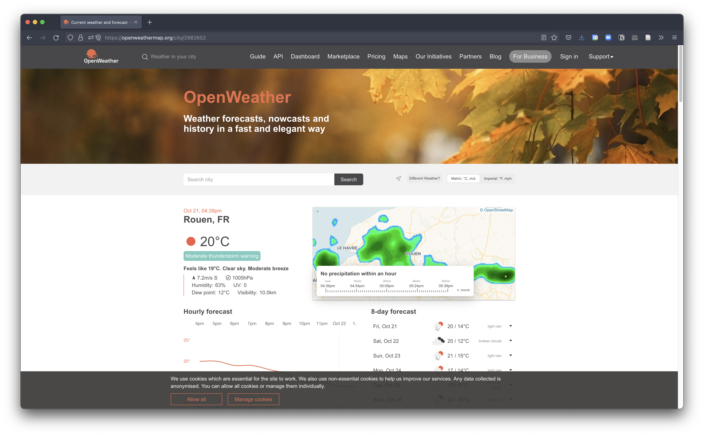
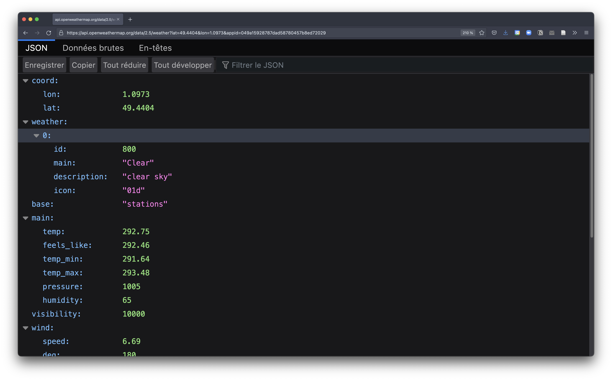
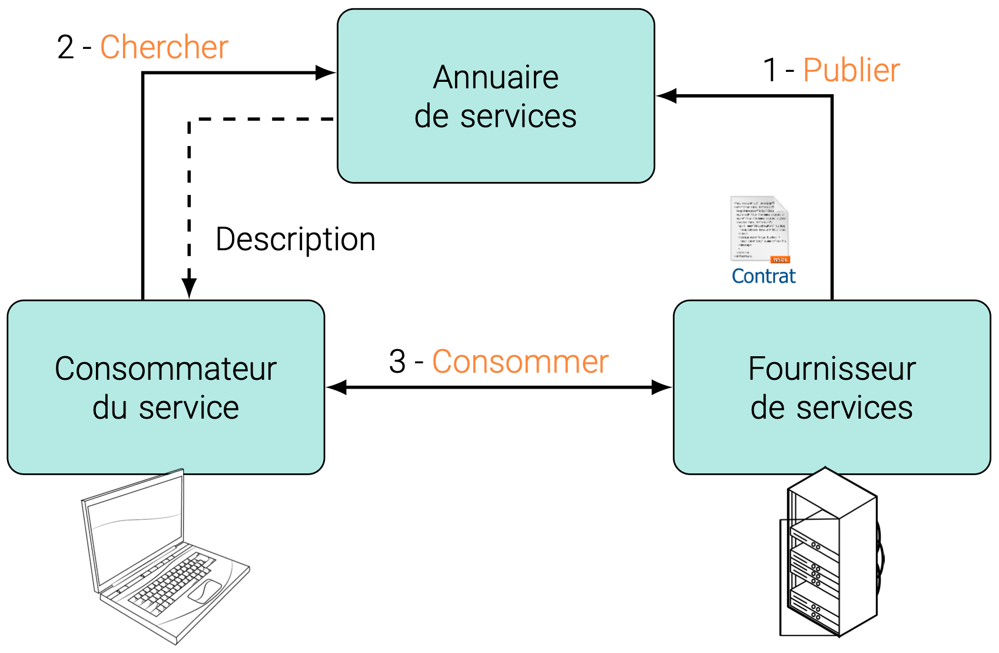
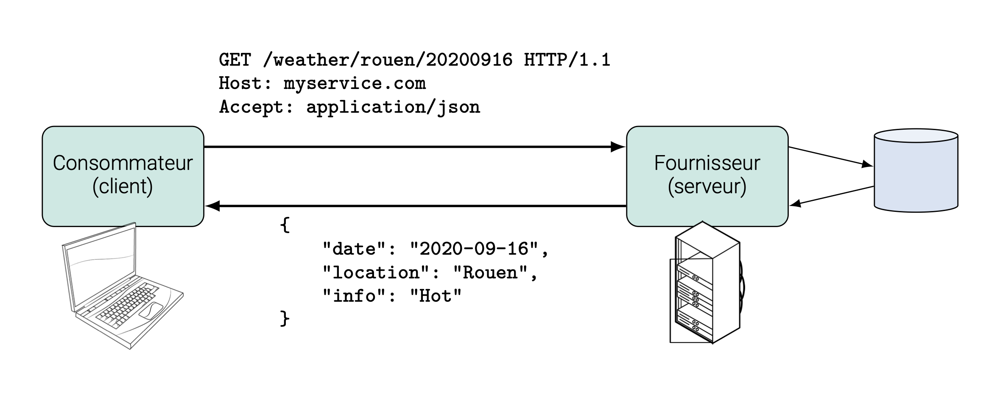
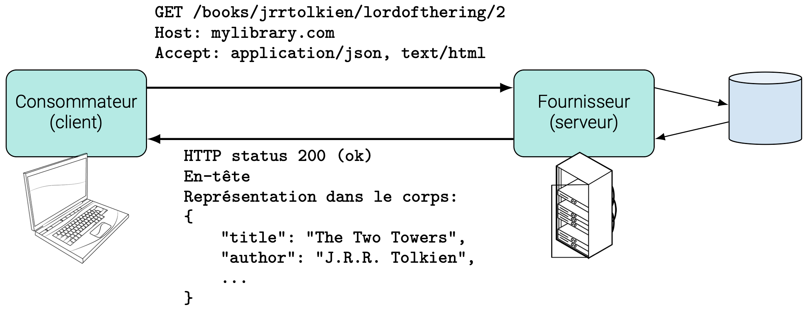
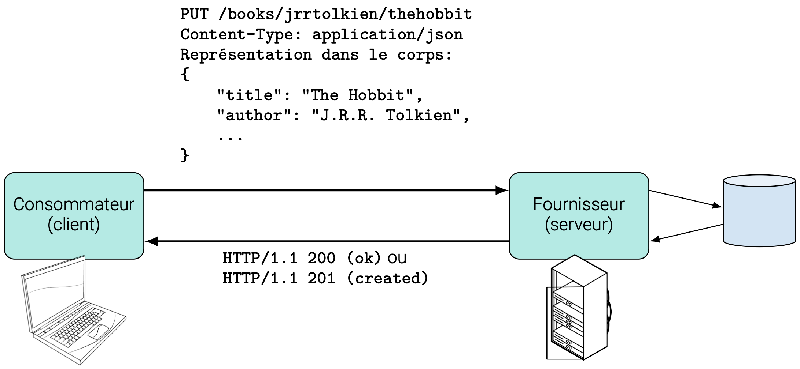
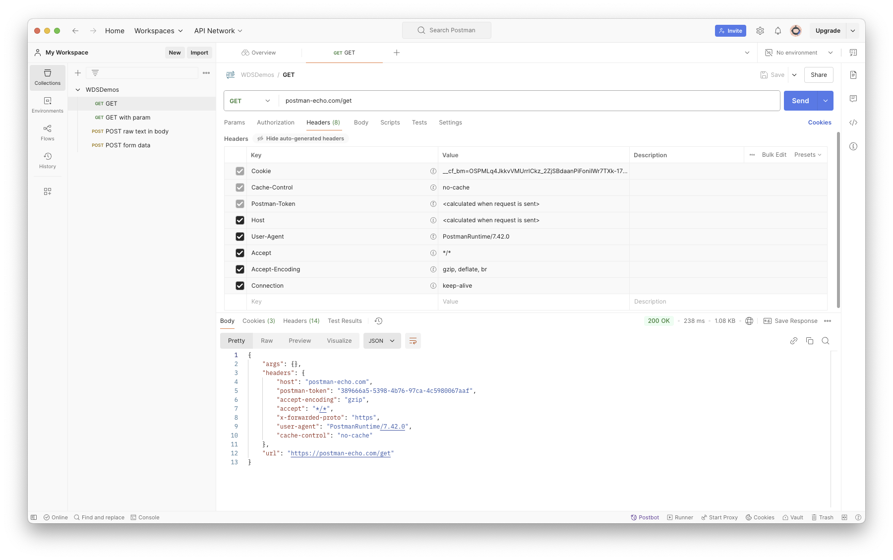
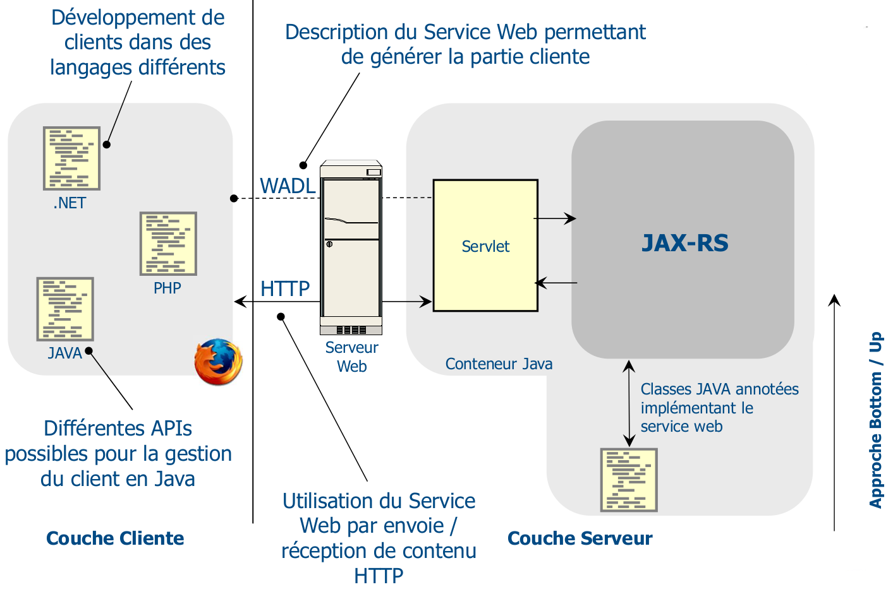
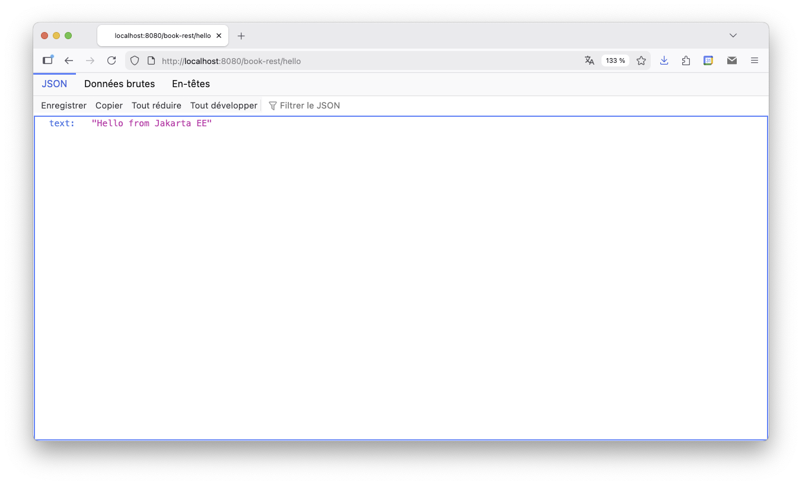

class: middle, center, title-slide
name: lecture5

# Web Dynamique côté Serveur
## Lecture 5 : Jakarta REST
<br><br>
Simon BERNARD<br>
[simon.bernard@univ-rouen.fr](mailto:simon.bernard@univ-rouen.fr)<br><br>
.center.height-4em[]

---
class: middle, center
# Service Web RESTful


---
# Architecture Orientée Service (SOA)

## Deux familles d'applications Web

- **Orientée présentation**
  - Génère des pages web dynamiques en réponses aux requêtes HTTP
  - À destination d'un utilisateur *humain*
  - Ce que nous avons vu jusqu'ici, notamment avec Jakarta Faces
- **Orientée services**
  - Génère des structures de données dynamiques en réponses aux requêtes HTTP
  - À destination d'autres applications (clients lourds, applications mobiles, autres serveurs...)
  - Utilisation de protocoles légers (HTTP/HTTPS) et de formats de données standardisés (JSON, XML...)
  - Ce que nous allons voir avec Jakarta REST

---
# Architecture Orientée Service (SOA)

- Communication *human-to-machine* : il faut une interface graphique
- HTML/CSS/JS

.center.width-80[

*[https://openweathermap.org/city/2982652](https://openweathermap.org/city/2982652)*
]

---
# Architecture Orientée Service (SOA)

- Communication *machine-to-machine* : un format de données commun
- XML ou JSON (ci-dessous)

.center.width-80[

*[https://api.openweathermap.org/data/2.5/weather?lat=49.4404&lon=1.0973&appid=0...9](https://api.openweathermap.org/data/2.5/weather?lat=49.4404&lon=1.0973&appid=049a15928787dad58780457b8ed72029)*
]

---
# Architecture Orientée Service (SOA)

- SOA est un style d'architecture pour la mise en oeuvre de ce type d'échange

.row[
.col-60[
.width-100[]
]
.col-40[
1. **Publier** : le fournisseur du service publie son service via le contrat
2. **Chercher** : le consommateur cherche un service répondant à ces exigences (un contrat lui est retourné)
3. **Consommer** : le consommateur utilise le service conformément au contrat
]
]

---
# Architecture Orientée Service (SOA)

## 2 familles de services web

1. **Services web "étendus"** ou SOAP
  - Application "classique" de SOA pour le Web
  - S'appuie sur des standards dédiés : UDDI pour les annuaires, WSDL pour les contrats, SOAP pour les messages
  - Inconvénient : standards "lourds" et couplage fort entre le consommateur et le fournisseur
2. **Services web RESTful** ou API Web
  - Architecture orientée ressources (ROA)
  - S'appuie sur le fonctionnement du web : URL pour identifier les ressources et HTTP pour la communication
  - Pas d'annuaire mais une interface uniforme (et des documentation d'API)

---
# Services web RESTful

.box[**REpresentational State Transfer (REST)** : style d'architecture définissant un ensemble de contraintes à utiliser pour créer des services web. Ces contraintes restreignent la façon dont le serveur peut traiter et répondre aux requêtes du client afin de garantir la performance, l'extensibilité, la simplicité, l'évolutivité, la visibilité, la portabilité et la fiabilité. .small[(source : [Wikipedia](https://fr.wikipedia.org/wiki/Representational_state_transfer))]]

Contraintes architecturales :
- Architecture client-serveur
- Protocole de communication sans état (*stateless*), e.g. HTTP
- Interface uniforme (pas de contrat) :
  - Ressources identifiées dans les requêtes (URL)
  - Manipulation des ressources par représentation (XML, JSON)
  - Messages auto-descriptifs (méthodes HTTP)

---
# Services web RESTful

- Le client envoie une requête HTTP ciblant une ressource identifiée par une URL
- La méthode HTTP indique l'action à réaliser sur la ressource (GET, POST, PUT, DELETE, ...)
- Le serveur renvoie une représentation de la ressource au format JSON ou XML

.center.width-90[]

---
# Architecture orientée ressource

- Une ressource est "quelque chose" qui peut être identifiée par une URL
```shell
http://localhost:8080/books/jrrtolkien/lordofthering/2
```
- Il peut y avoir plusieurs URL différentes pour une même ressource
```shell
http://localhost:8080/books/jrrtolkien/lordofthering/2
http://localhost:8080/books/jrrtolkien/lordofthering/twotours
```
- Une URL peut désigner une collection de ressources
```shell
http://localhost:8080/books/jrrtolkien/lordofthering
http://localhost:8080/books/jrrtolkien
```
- Une ressource peut être fournies dans des formats différents en fonction de l'en-tête HTTP `Accept` (cf. [documentation](https://developer.mozilla.org/en-US/docs/Web/HTTP/Headers/Accept))

---
# Requête REST

- Client "riche" = il doit pouvoir savoir comment construire la requête
- Interface uniforme basé sur des standards d'opération (CRUD) :
  1. **Create** → `POST`
  2. **Read** → `GET`
  3. **Update** → `PUT` (remplacement complet) ou `PATCH` (modification partielle)
  4. **Delete** → `DELETE`
- Techniquement, le fournisseur du service peut décider de ne pas respecter ce standard
- Mais la facilité d'utilisation du service dépend largement de ces conventions

---
# Requête REST

## Exemple

.center.width-90[]

- Le serveur impose la ou les représentations disponibles
- Mais le client doit pouvoir l'anticiper : documentation ou `Accept`

---
# Requête REST

## Exemple

.center.width-90[]

- Le serveur décide de l'URL de la nouvelle ressource
- La réponse inclue souvent la représentation nouvellement créée

---
# Requête REST

## Exemple

.center.width-90[]

- La ressource est entièrement remplacée ou créée à l'URL indiquée si elle n'existe pas
- Quand le client connaît l'URL de la ressource à modifier/créer : `PUT` au lieu de `POST`

---
# Requête REST

## Exemples

.center.width-100[]

---
class: middle, center
# Jakarta REST


---
# Jakarta REST (anciennement JAX-RS)

- **Basée sur des annotations** pour définir les ressources et les méthodes HTTP associées
- L'implémentation de l'API (e.g. Jersey) fournit la servlet de façade

.center.width-70[

*source : [https://mickael-baron.fr/soa/](https://mickael-baron.fr/soa/)*
]

---
# Jakarta REST (anciennement JAX-RS)

- Pour activer le framework :
```xml
    <servlet>
        <servlet-name>jersey-Servlet</servlet-name>
        <servlet-class>org.glassfish.jersey.servlet.ServletContainer</servlet-class>
        <init-param>
            <param-name>jersey.config.server.provider.packages</param-name>
            <param-value>fr.urn.mastersime</param-value>
        </init-param>
        ...
    </servlet>
    <servlet-mapping>
        <servlet-name>jersey-Servlet</servlet-name>
        <url-pattern>/api/*</url-pattern>
    </servlet-mapping>
```
ou avec une classe d'activation :
```java
    @ApplicationPath("/api")
    public class ApplicationConfig extends Application { }
```

---
# Jakarta REST (anciennement JAX-RS)

- Pour définir une ressource :
```java
    import jakarta.ws.rs.GET;
    import jakarta.ws.rs.core.MediaType;
    import jakarta.ws.rs.Path;
    import jakarta.ws.rs.Produces;
    @Path("hello")
    public class HelloResource {
        @GET
        @Produces(MediaType.APPLICATION_JSON)
        public HelloRecord hello(){
            return new HelloRecord("Hello from Jakarta EE");
        }
    }
```
- `@Path("hello")` : pour définir l'URL associée à la ressource *hello*
- `@GET` : pour indiquer que la méthode répond à une requête `GET`
- `@Produces(MediaType.APPLICATION_JSON)` : pour indiquer que la méthode produit une réponse JSON

---
# Jakarta REST (anciennement JAX-RS)

.center.width-80[]

---
# Les annotations JAX-RS

- Une classe annotée avec `@Path` définit une ressource ou un ensemble de ressources
- L'URL de la classe est l'URL racine des ressources
- Les méthodes de classe peuvent également être associées à une sous-URL
```java
    @Path("books")
    public class BookResource {
        @GET
        @Path("{id}")
        public Book getBook(@PathParam("id") String id) { ... }
        @GET
        public List<Book> getAllBooks() { ... }
    }
```
- Une requête `GET http://localhost:8080/bookapi/books/123` appelle la méthode `getBook("123")`
- Une requête `GET http://localhost:8080/bookapi/books` appelle la méthode `getAllBooks()`

---
# Les annotations JAX-RS

- `Path` autorise les paramètres d'URL
```java
    @Path("books")
    public class BookResource {
        @GET
        @Path("{id}")
        public Book getBook(@PathParam("id") String id) { ... }
        @GET
        @Path("search-{tag}")
        public List<Book> searchBooksByTag(@PathParam("tag") String tag) { ... }
    }
```
- Une requête `GET http://.../books/search-sciencefiction` appelle `searchBooksByTag("sciencefiction")`

---
# Les annotations JAX-RS

- Paramètre possible aussi dans l'URL de la classe
```java
    @Path("books/{id: [0-9]{5}}")
    public class BookResource {
        @GET
        public Book getBook(@PathParam("id") String id) { ... }
    }
```
- Possible car **création d'une instance pour chaque requête reçue**
- Transtypage automatique vers les types primitifs et les `String`
- Spécification de motif avec une expression régulière

---
# Les annotations JAX-RS

- `consume/produce` permet d'indiquer le type de contenu attendu ou fourni
```java
    @GET
    @Produces(MediaType.TEXT_PLAIN)
    public String getBook(@PathParam("id") String id) { ... }
    @GET
    @Produces(MediaType.APPLICATION_JSON)
    public Book getBook(@PathParam("id") String id) { ... }
```
- La première méthode retourne une représentation sous la forme d'un `String`
- La seconde retourne un objet Java qui sera automatiquement converti en JSON
- De même pour la réponse :
```java
    @POST
    @Consumes(MediaType.APPLICATION_JSON)
    public void createBook(Book book) { ... }
```
- Le corps de la requête est automatiquement converti en objet Java

---
# Les annotations JAX-RS

- `QueryParam/FormParam` permettent de récupérer les paramètres de requête ou de formulaire
- `QueryParam` pour les paramètres de requête
```java
    @GET
    @Produces(MediaType.APPLICATION_JSON)
    public List<Book> searchBooks(@QueryParam("title") String title) { ... }
```
- Une requête `GET http://.../books?title=sciencefiction` appelle `searchBooks("sciencefiction")`
- `FormParam` pour les paramètres de formulaire
```java
    @POST
    @Consumes(MediaType.APPLICATION_FORM_URLENCODED)
    public void createBook(@FormParam("title") String title, @FormParam("author") String author) { ... }
```
- Dans ce cas, le type du corps de la requête doit être `application/x-www-form-urlencoded`
- Sur le même principe, `HeaderParam` pour les paramètres d'en-tête et `CookieParam` pour les cookies

---
# Les annotations JAX-RS

- `Context` permet d'injecter des objets/informations du contexte de l'application
```java
    @GET
    public Response getRequestInfo(@Context UriInfo ui) {
        MultivaluedMap<String, String> queryParams = ui.getQueryParameters();
        MultivaluedMap<String, String> pathParams = ui.getPathParameters();
    }
```
ou
```java
    @Path("helloworld")
    public class HelloWorld {
        @Context
        private UriInfo context;
        ...
    }
```
- Autre type d'informations de context accessibles : [documentation](https://jakarta.ee/specifications/restful-ws/4.0/jakarta-restful-ws-spec-4.0#context)

---
# Data Binding

- Quand une méthode annotée retourne un objet Java, JAX-RS tente de convertir au format souhaité
- JAX-RS fournit des mécanismes de conversion automatique : *Data binding*
- Les conversions en JSON sont transparente et s'appuient sur les *getters* et *setters*
- Les conversions en XML nécessitent des annotations spécifiques
- La conversion objet Java vers JSON est prise en charge par l'API [JSON-B](https://jakarta.ee/specifications/jsonb/3.0/jakarta-jsonb-spec-3.0)
- La conversion objet Java vers XML est prise en charge par l'API [Jakarta XML Binding (JAXB)](https://jakarta.ee/specifications/xml-binding/4.0/jakarta-xml-binding-spec-4.0.html)

---
# Data Binding

## Exemple

```java
public class Person {
    private String name;
    private int age;
    private List<Person> children = new ArrayList<>();

    //constructeurs
    ...

    public String getName() {
        return name;
    }
    public void setName(String name) {
        this.name = name;
    }
    ...

    public Person addChild(Person child) {
        this.children.add(child);
        return child;
    }
}
```

---
# Data Binding

## Exemple

```java
@Path("person")
public class PersonResource {
    @GET
    @Produces(MediaType.APPLICATION_JSON)
    public Person get() {
        Person michel = new Person("Michel Dupont", 56);
        Person anne = new Person("Anne Dupont", 38);
        michel.addChild(new Person("Damien Dupont", 32));
        michel.addChild(anne);
        anne.addChild(new Person("Pierre Durant", 16));
        return michel;
    }
}
```

---
# Data Binding

## Exemple

- Représentation JSON retournée au client pour l'objet `michel` :
```json
    {
        "children":[
            {
                "children":[
                    {
                        "children":[],
                        "name":"Pierre Durant",
                        "age":16
                    }
                ],
                "name":"Anne Dupont",
                "age":38
            },

            {
                "children":[],
                "name":"Damien Dupont",
                "age":32
            }
        ],
        "name":"Michel Dupont",
        "age":56
    }
```

---
# Data Binding

- Pour en faire autant avec XML, il faut ajouter des annotations à la classe `Person`
- Fournissent des indications sur la façon dont la classe Java peut être associée à un document XML :
  - `@XmlRootElement` : indique que la classe peut être la racine d'un document XML
  - `@XmlElement` : sur un *getter* pour préciser que l'attribut est un élément XML (optionnel)
  - `@XmlAttribute` : sur un *getter* pour préciser que l'attribut est un attribut XML
  - `@XmlTransient` : pour indiquer que l'attribut ne doit pas être inclus dans la représentation XML
- Attributs d'annotation disponible pour modifier les noms et namespaces des éléments XML (par défaut, identiques aux identificateurs Java)

---
# Data Binding

## Exemple

```java
@XmlRootElement(name="person", namespace="http://mastersd.urn/person")
public class Person {
    private String name;
    private int age;
    private List<Person> children = new ArrayList<>();
    ...

    @XmlElement(namespace="http://mastersd.urn/person")
    public String getName() {
        return name;
    }
    ....

    @XmlElementWrapper(name="children", namespace="http://mastersid.urn/person")
    @XmlElement(name="person", namespace="http://mastersid.urn/person")
    public List<Person> getChildren() {
        return children;
    }
}
```

---
# Data Binding

## Exemple

- Représentation XML retournée au client pour l'objet `michel` :
```xml
    <?xml version="1.0" encoding="UTF-8" standalone="yes"?>
    <person xmlns="http://mastersd.urn/person">
        <age>56</age>
        <children>
            <person>
                <age>38</age>
                <children>
                    <person>
                        <age>16</age>
                        <children/>
                        <name>Pierre Durant</name>
                    </person>
                </children>
                <name>Anne Dupont</name>
            </person>
            <person>
                <age>32</age>
                <children/>
                <name>Damien Dupont</name>
            </person>
        </children>
        <name>Michel Dupont</name>
    </person>
```

---
# Data Binding

- Si `@Produces` autorise les 2 formats, les annotations JAXB sont utilisées pour JSON aussi
```java
    @Path("/person")
    public class PersonResource {
        @GET
        @Produces({MediaType.APPLICATION_JSON, MediaType.APPLICATION_XML})
        public Person get() {
            // ...
        }
        @POST
        @Consumes(MediaType.APPLICATION_JSON)
        @Produces({MediaType.APPLICATION_JSON, MediaType.APPLICATION_XML})
        public void post(Person person) {
            // ...
        }
    }
```

---
# Réponse du serveur au client

- Jusqu'ici, la réponse est automatiquement construite à partir du retour de la méthode (`void`, `String` ou objet Java)
```shell
    HTTP / <Versions><Status><Commentaire Status>
    Content-Type:<Type MIME du contenu>
    [<Champ d'en-tête>:<Valeur>]
    ...
    Ligne vide
    Document
```
- `Document` représente l'objet retourné par la méthode Java (en XML ou JSON selon le type MIME)
- On a souvent besoin de spécifier en même temps le code HTTP et les en-têtes (e.g. statut, type, etc.)

---
# Réponse du serveur au client

- Par exemple, les status HTTP sont importants pour informer le client en cas de problème
- `100-199` : informationnel
- `200-299` : succès
  - `200 OK`
  - `201 Created`
- `300-399` : redirection
  - `301 Redirection`
  - `302 Move Temporarily`
- `400-499` : erreur client
  - `400 Bad Request`
  - `404 Not Found`
- `500-599` : erreur serveur
  - `500 Internal Server Error`
  - `503 Service Unavailable`

---
# Réponse du serveur au client

- Pour personnaliser la réponse, la méthode ressource doit renvoyer un objet `Response`
- Construction de la réponse avec un *builder* :
```java
    @Path("/books")
    public class BookResource {
        @GET
        @Path("/{id}")
        @Produces({MediaType.APPLICATION_JSON, MediaType.APPLICATION_XML})
        public Response getByIndex(@PathParam("id") int id) {
            try {
                Book book = books.get(id);
                return Response.ok(book).build();
            } catch(InvalidBookException e) {
                return Response.status(404).entity(e.getMessage()).build();
            }
        }
        ...
    }
```
- `ok`, `status` et `entity` sont des méthodes statiques de la classe `ResponseBuilder`
- La méthode `build` construit l'objet `Response` final

---
# API Client de Jakarta REST

- Le client n'est pas supposé être conçu en Jakarta, ni même forcément en Java
- Par exemple, il peut être conçu en JavaScript et utilisé via un navigateur (interface HTML)
- Jakarta REST fournit tout de même une API client pour faciliter les appels REST
```java
    public class BookClient {
        public static void main(String[] args) {
            Client client = ClientBuilder.newClient();
            WebTarget target = client.target("http://localhost:8080/bookapi/books/123");
            Book book = target.request().accept(MediaType.APPLICATION_JSON).get(Book.class);
            System.out.println(book);
        }
    }
```
- Plus de détails dans la [documentation](https://jakarta.ee/learn/docs/jakartaee-tutorial/current/websvcs/rest-client/rest-client.html)

---
class: middle, dark-slide

# Live coding: Le projet `bookrest`