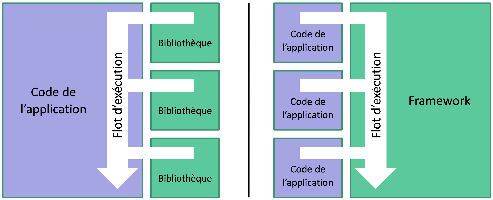
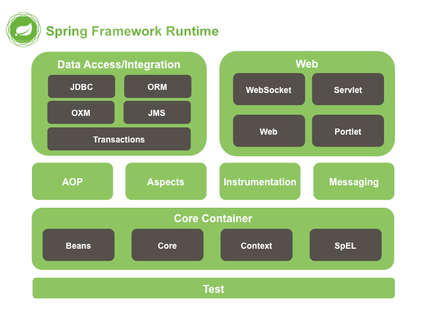

class: middle, center, title-slide
name: lecture7

# Web Dynamique côté Serveur
## 7. Spring
  
Simon BERNARD 
[simon.bernard@univ-rouen.fr](mailto:simon.bernard@univ-rouen.fr)  
.center.height-4em[]

---
class: middle, center
# Présentation de Spring Framework

---
# Jakarta EE vs Spring

|  | Jakarta EE | Spring |
|---------|--------------|--------|
| Philosophie | **Container-based** - basé sur des API standards et des services externes, mise en oeuvre par le conteneur | **Lightweight** - embarque les services dont elle a besoin, et parfois même son propre conteneur (Spring Boot) |
| Difficulté d'utilisation | Élevé au début mais n'augmente pas avec la taille de l'architecture | Simple à prendre en main mais devient complexe avec la taille de l'architecture |
| Points forts | Standard (*write once, run anywhere*), robuste et maintenable | Développement rapide, flexible, modulaire et léger (*use only what you need*) |
| Cas d'usage type | Applications d'entreprise avec architecture complexe | Applications web et microservices |

---
# Centré sur l'inversion de contrôle (IoC)

.box[IoC est un patron d'architecture commun à tous les frameworks: le flot d'exécution n'est plus sous le contrôle direct de l'application mais est délégué à un conteneur. Le conteneur est responsable de l'instanciation des objets et de la gestion de leur cycle de vie.]

.center.width-70[]

---
count: false
# Centré sur l'inversion de contrôle (IoC)

.box.mb-4[IoC est un patron d'architecture commun à tous les frameworks: le flot d'exécution n'est plus sous le contrôle direct de l'application mais est délégué à un conteneur. Le conteneur est responsable de l'instanciation des objets et de la gestion de leur cycle de vie.]

- Spring fournit l'environnement d'exécution, c'est-à-dire:
  - le conteneur IoC 
  - les modules pour la prise en charge des autres services
- Le développeur fournit les composants et leur configuration, c'est-à-dire:
  - des beans (POJOs)
  - des fichiers de configuration (XML) ou des annotations
- Déploiement sur un serveur léger (i.e. conteneur de servlet) car pas besoin des autres API Jakarta

---
# L'écosystème Spring

- Spring Framework: le framework de base
- l'écosystème .exponent[(1)] : 21 projets bâtis sur Spring Framework, dont:
  - Spring Boot: pour simplifier la configuration et le déploiement
  - Spring Data: pour l'accès aux données
  - Spring Security: pour la sécurité
  - Spring Cloud: pour le développement de microservices
  - Spring AI: pour l'intégration de l'IA dans les applications Spring
- Chaque projet est divisé en modules, chacun fournissant un service spécifique (ex: Spring Data JPA, Spring Data MongoDB, etc.)

.footnote[(1) [https://spring.io/projects](https://spring.io/projects)]

---
# Les modules de Spring Framework

.center.width-60[]
